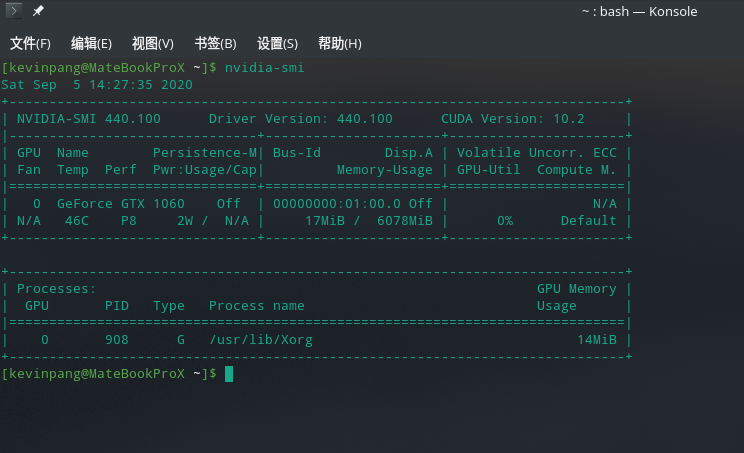
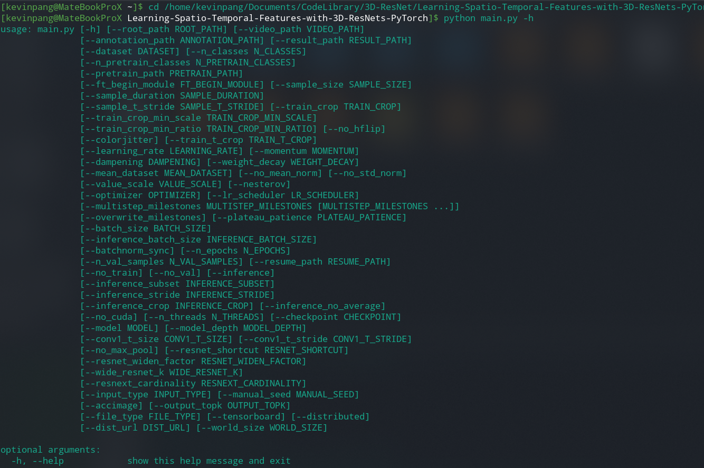
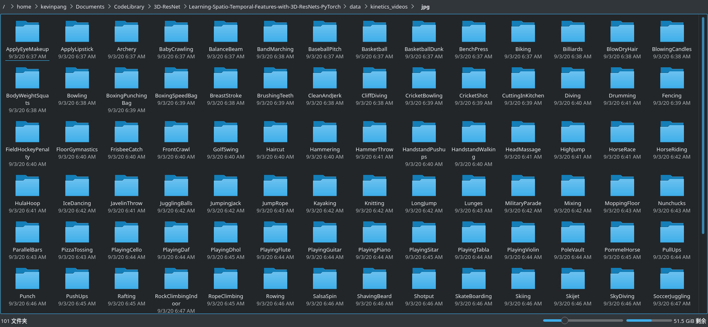
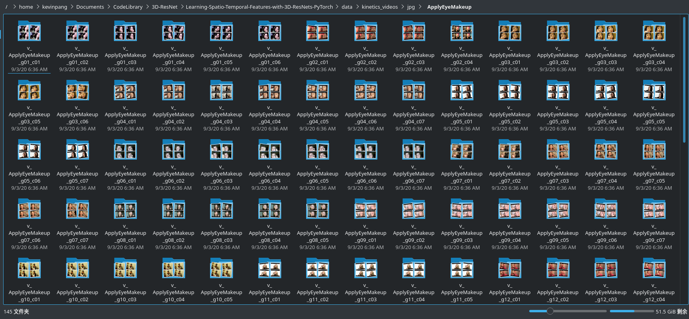
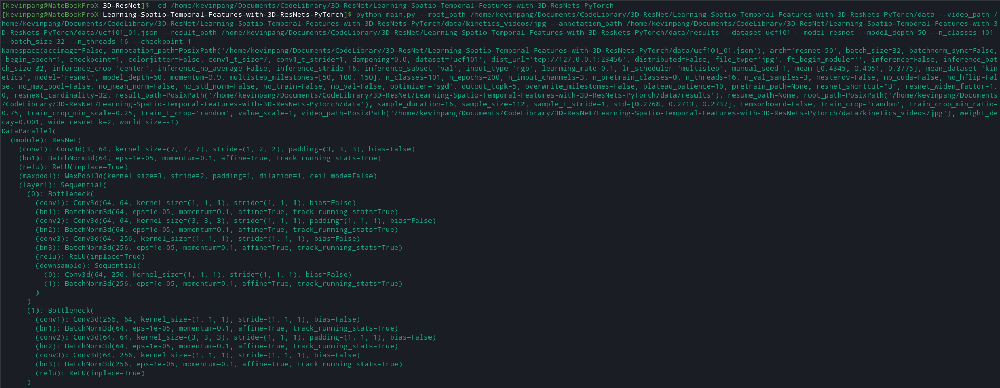
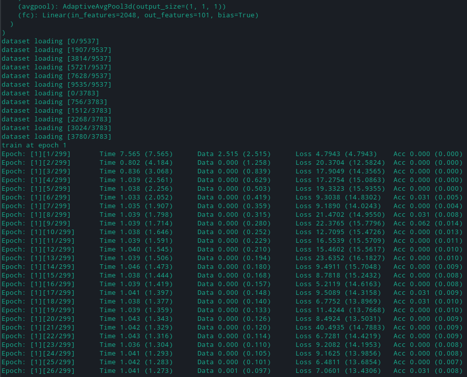
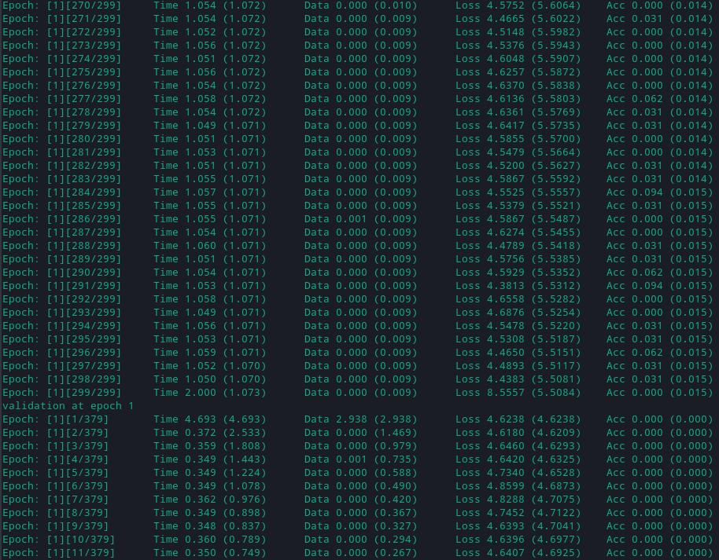
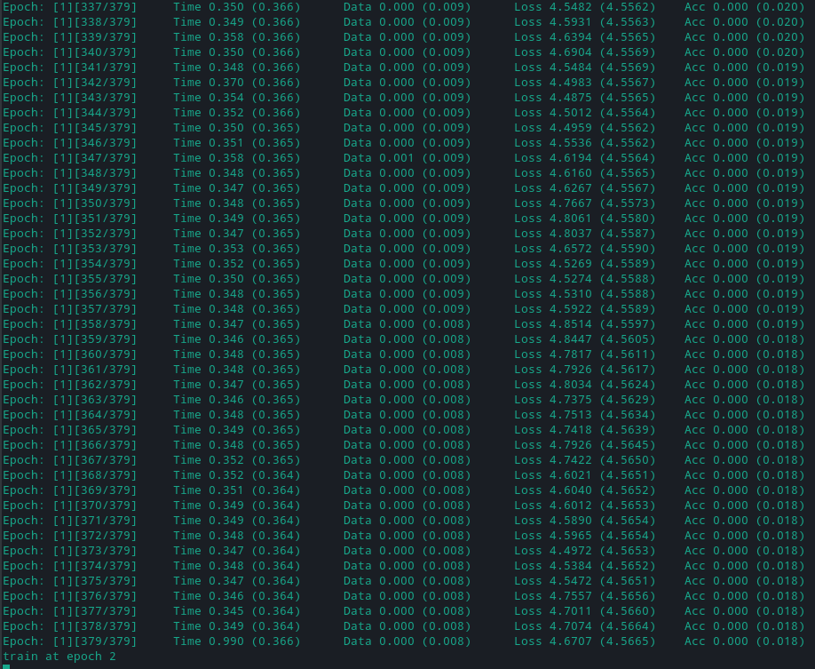
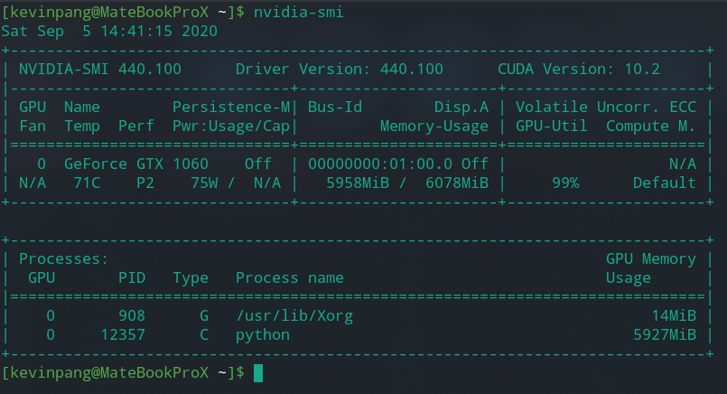

# 3D-ResNets-PaddlePaddle
通过使用PaddlePaddle复现3D ResNets论文

# 1 前期准备工作
在使用PaddlePaddle复现论文代码前，我们需要先理解3D_ResNets论文并用Pytorch跑通一遍代码，理解其传入参数、网络结构、传出参数等。这些我就统一归为前期准备工作。


以下是本人先前阅读论文《Learning Spatio-Temporal Features with 3D Residual Networks
for Action Recognition》时做的一些笔记：

https://blog.csdn.net/qq_41138197/article/details/107832207

以下是论文《Would Mega-scale Datasets Further Enhance Spatiotemporal 3D CNNs》的下载地址：

https://arxiv.org/abs/2004.04968

## 1.1 本地环境配置
- 首先，需要一台N卡的笔记本，然后配置好CUDA和cudnn。Linux环境下Arch系配置方式可参考https://www.bilibili.com/read/cv6438916?spm_id_from=333.788.b_636f6d6d656e74.7
- 然后，安装paddlepaddle-gpu和pytorch。
   - PaddlePaddle安装可参考 https://www.paddlepaddle.org.cn/install/quick
   - Pytorch建议直接用pip安装 pip install torch torchvision）
- 运行过程中如出现"No moudle..."，一般情况下表明你需要使用pip安装对应的包，或者需要调整文件目录结构以保证能够正确调用本地的py文件。

### 本地CUDA安装截图
配置方式可参考：https://www.bilibili.com/read/cv6438916?spm_id_from=333.788.b_636f6d6d656e74.7



## 1.2 目录结构设置

**目录结构**：可理解为文件层级目录，无论是本地还是远程服务器都需要按论文中的要求配置。
```
~/
  data/
    kinetics_videos/
      jpg/
        .../ (directories of class names)
          .../ (directories of video names)
            ... (jpg files)
    results/
      save_100.pth
    kinetics.json
```

## 1.3 理解main.py参数
在执行python main.py时，后可跟一系列的参数，它们是什么意思？有什么作用？这些我们需要在训练前就先尽可能有一个相对清晰的概念。

进入GitHub源码解压后的文件目录，输入 `python main.py -h` 即可查看，若前面配置有小伙伴无法满足（比如N卡），可参考我在本地查到的help：



```bash
[kevinpang@MateBookProX ~]$ cd /home/kevinpang/Documents/CodeLibrary/3D-ResNet/Learning-Spatio-Temporal-Features-with-3D-ResNets-PyTorch
[kevinpang@MateBookProX Learning-Spatio-Temporal-Features-with-3D-ResNets-PyTorch]$ python main.py -h
usage: main.py [-h] [--root_path ROOT_PATH] [--video_path VIDEO_PATH]
               [--annotation_path ANNOTATION_PATH] [--result_path RESULT_PATH]
               [--dataset DATASET] [--n_classes N_CLASSES]
               [--n_pretrain_classes N_PRETRAIN_CLASSES]
               [--pretrain_path PRETRAIN_PATH]
               [--ft_begin_module FT_BEGIN_MODULE] [--sample_size SAMPLE_SIZE]
               [--sample_duration SAMPLE_DURATION]
               [--sample_t_stride SAMPLE_T_STRIDE] [--train_crop TRAIN_CROP]
               [--train_crop_min_scale TRAIN_CROP_MIN_SCALE]
               [--train_crop_min_ratio TRAIN_CROP_MIN_RATIO] [--no_hflip]
               [--colorjitter] [--train_t_crop TRAIN_T_CROP]
               [--learning_rate LEARNING_RATE] [--momentum MOMENTUM]
               [--dampening DAMPENING] [--weight_decay WEIGHT_DECAY]
               [--mean_dataset MEAN_DATASET] [--no_mean_norm] [--no_std_norm]
               [--value_scale VALUE_SCALE] [--nesterov]
               [--optimizer OPTIMIZER] [--lr_scheduler LR_SCHEDULER]
               [--multistep_milestones MULTISTEP_MILESTONES [MULTISTEP_MILESTONES ...]]
               [--overwrite_milestones] [--plateau_patience PLATEAU_PATIENCE]
               [--batch_size BATCH_SIZE]
               [--inference_batch_size INFERENCE_BATCH_SIZE]
               [--batchnorm_sync] [--n_epochs N_EPOCHS]
               [--n_val_samples N_VAL_SAMPLES] [--resume_path RESUME_PATH]
               [--no_train] [--no_val] [--inference]
               [--inference_subset INFERENCE_SUBSET]
               [--inference_stride INFERENCE_STRIDE]
               [--inference_crop INFERENCE_CROP] [--inference_no_average]
               [--no_cuda] [--n_threads N_THREADS] [--checkpoint CHECKPOINT]
               [--model MODEL] [--model_depth MODEL_DEPTH]
               [--conv1_t_size CONV1_T_SIZE] [--conv1_t_stride CONV1_T_STRIDE]
               [--no_max_pool] [--resnet_shortcut RESNET_SHORTCUT]
               [--resnet_widen_factor RESNET_WIDEN_FACTOR]
               [--wide_resnet_k WIDE_RESNET_K]
               [--resnext_cardinality RESNEXT_CARDINALITY]
               [--input_type INPUT_TYPE] [--manual_seed MANUAL_SEED]
               [--accimage] [--output_topk OUTPUT_TOPK]
               [--file_type FILE_TYPE] [--tensorboard] [--distributed]
               [--dist_url DIST_URL] [--world_size WORLD_SIZE]

optional arguments:
  -h, --help            show this help message and exit
  --root_path ROOT_PATH
                        Root directory path
  --video_path VIDEO_PATH
                        Directory path of videos
  --annotation_path ANNOTATION_PATH
                        Annotation file path
  --result_path RESULT_PATH
                        Result directory path
  --dataset DATASET     Used dataset (activitynet | kinetics | ucf101 |
                        hmdb51)
  --n_classes N_CLASSES
                        Number of classes (activitynet: 200, kinetics: 400 or
                        600, ucf101: 101, hmdb51: 51)
  --n_pretrain_classes N_PRETRAIN_CLASSES
                        Number of classes of pretraining task.When using
                        --pretrain_path, this must be set.
  --pretrain_path PRETRAIN_PATH
                        Pretrained model path (.pth).
  --ft_begin_module FT_BEGIN_MODULE
                        Module name of beginning of fine-tuning(conv1, layer1,
                        fc, denseblock1, classifier, ...).The default means
                        all layers are fine-tuned.
  --sample_size SAMPLE_SIZE
                        Height and width of inputs
  --sample_duration SAMPLE_DURATION
                        Temporal duration of inputs
  --sample_t_stride SAMPLE_T_STRIDE
                        If larger than 1, input frames are subsampled with the
                        stride.
  --train_crop TRAIN_CROP
                        Spatial cropping method in training. random is
                        uniform. corner is selection from 4 corners and 1
                        center. (random | corner | center)
  --train_crop_min_scale TRAIN_CROP_MIN_SCALE
                        Min scale for random cropping in training
  --train_crop_min_ratio TRAIN_CROP_MIN_RATIO
                        Min aspect ratio for random cropping in training
  --no_hflip            If true holizontal flipping is not performed.
  --colorjitter         If true colorjitter is performed.
  --train_t_crop TRAIN_T_CROP
                        Temporal cropping method in training. random is
                        uniform. (random | center)
  --learning_rate LEARNING_RATE
                        Initial learning rate(divided by 10 while training by
                        lr scheduler)
  --momentum MOMENTUM   Momentum
  --dampening DAMPENING
                        dampening of SGD
  --weight_decay WEIGHT_DECAY
                        Weight Decay
  --mean_dataset MEAN_DATASET
                        dataset for mean values of mean
                        subtraction(activitynet | kinetics | 0.5)
  --no_mean_norm        If true, inputs are not normalized by mean.
  --no_std_norm         If true, inputs are not normalized by standard
                        deviation.
  --value_scale VALUE_SCALE
                        If 1, range of inputs is [0-1]. If 255, range of
                        inputs is [0-255].
  --nesterov            Nesterov momentum
  --optimizer OPTIMIZER
                        Currently only support SGD
  --lr_scheduler LR_SCHEDULER
                        Type of LR scheduler (multistep | plateau)
  --multistep_milestones MULTISTEP_MILESTONES [MULTISTEP_MILESTONES ...]
                        Milestones of LR scheduler. See documentation of
                        MultistepLR.
  --overwrite_milestones
                        If true, overwriting multistep_milestones when
                        resuming training.
  --plateau_patience PLATEAU_PATIENCE
                        Patience of LR scheduler. See documentation of
                        ReduceLROnPlateau.
  --batch_size BATCH_SIZE
                        Batch Size
  --inference_batch_size INFERENCE_BATCH_SIZE
                        Batch Size for inference. 0 means this is the same as
                        batch_size.
  --batchnorm_sync      If true, SyncBatchNorm is used instead of BatchNorm.
  --n_epochs N_EPOCHS   Number of total epochs to run
  --n_val_samples N_VAL_SAMPLES
                        Number of validation samples for each activity
  --resume_path RESUME_PATH
                        Save data (.pth) of previous training
  --no_train            If true, training is not performed.
  --no_val              If true, validation is not performed.
  --inference           If true, inference is performed.
  --inference_subset INFERENCE_SUBSET
                        Used subset in inference (train | val | test)
  --inference_stride INFERENCE_STRIDE
                        Stride of sliding window in inference.
  --inference_crop INFERENCE_CROP
                        Cropping method in inference. (center | nocrop)When
                        nocrop, fully convolutional inference is performed,and
                        mini-batch consists of clips of one video.
  --inference_no_average
                        If true, outputs for segments in a video are not
                        averaged.
  --no_cuda             If true, cuda is not used.
  --n_threads N_THREADS
                        Number of threads for multi-thread loading
  --checkpoint CHECKPOINT
                        Trained model is saved at every this epochs.
  --model MODEL         (resnet | resnet2p1d | preresnet | wideresnet |
                        resnext | densenet |
  --model_depth MODEL_DEPTH
                        Depth of resnet (10 | 18 | 34 | 50 | 101)
  --conv1_t_size CONV1_T_SIZE
                        Kernel size in t dim of conv1.
  --conv1_t_stride CONV1_T_STRIDE
                        Stride in t dim of conv1.
  --no_max_pool         If true, the max pooling after conv1 is removed.
  --resnet_shortcut RESNET_SHORTCUT
                        Shortcut type of resnet (A | B)
  --resnet_widen_factor RESNET_WIDEN_FACTOR
                        The number of feature maps of resnet is multiplied by
                        this value
  --wide_resnet_k WIDE_RESNET_K
                        Wide resnet k
  --resnext_cardinality RESNEXT_CARDINALITY
                        ResNeXt cardinality
  --input_type INPUT_TYPE
                        (rgb | flow)
  --manual_seed MANUAL_SEED
                        Manually set random seed
  --accimage            If true, accimage is used to load images.
  --output_topk OUTPUT_TOPK
                        Top-k scores are saved in json file.
  --file_type FILE_TYPE
                        (jpg | hdf5)
  --tensorboard         If true, output tensorboard log file.
  --distributed         Use multi-processing distributed training to launch N
                        processes per node, which has N GPUs.
  --dist_url DIST_URL   url used to set up distributed training
  --world_size WORLD_SIZE
                        number of nodes for distributed training
```

## 1.4 解压下载好的UCF-101视频数据集
命令说明：unzip -q 视频数据集压缩包所在目录 -d 解压的目标文件夹


## 1.5 视频转图片

命令格式：python -m util_scripts.generate_video_jpgs 视频地址 生成图片的保存地址 ucf101

将解压后的UCF-101视频文件转换为图片文件，保存在前面介绍的文件路径里面（~data/ucf_videos/jpg）。因为此处用的是UCF数据集，截图中的kinetics_videos应替换为ucf_videos（更改后会更规范一点，当时实现时没注意到这方面，后面实现的小伙伴可以留意留意）。






## 1.6 生成 json 格式的注释文件

python -m util_scripts.ucf101_json annotation_dir_path jpg_video_dir_path dst_json_path

- annotation_dir_path：txt注释文件地址
- jpg_video_dir_path：avi转jpg后，jpg地址
- dst_json_path：json文件存储路径，默认按要求设置在data目录下

## 1.7 开始本地Pytorch训练

```bash
python main.py --root_path /home/kevinpang/Documents/CodeLibrary/3D-ResNet/Learning-Spatio-Temporal-Features-with-3D-ResNets-PyTorch/data --video_path /home/kevinpang/Documents/CodeLibrary/3D-ResNet/Learning-Spatio-Temporal-Features-with-3D-ResNets-PyTorch/data/kinetics_videos/jpg --annotation_path /home/kevinpang/Documents/CodeLibrary/3D-ResNet/Learning-Spatio-Temporal-Features-with-3D-ResNets-PyTorch/data/ucf101_01.json --result_path /home/kevinpang/Documents/CodeLibrary/3D-ResNet/Learning-Spatio-Temporal-Features-with-3D-ResNets-PyTorch/data/results --dataset ucf101 --model resnet --model_depth 50 --n_classes 101 --batch_size 32 --n_threads 16 --checkpoint 1
```
batch_size此处经测试最终本地选用32这个值，因为原先的128会直接导致显存溢出。checkpoint是设置保存训练模型的epoch间隔，此处是每个1个保存一个，仅作测试，实际训练需根据个人实际需求调节。









Ps:运行上述代码时，Pytorch代码时的显存占用，供参考。



# 2 在AI STudio用paddlpaddle实现

## 2.1 解压UCF-101视频数据集


```python
!unzip -q data/data48916/UCF-101.zip -d work/data/ucf_101/video
```

## 2.2 实现视频转图片


```python
!python -m util_scripts.generate_video_jpgs work/data/ucf_101/video/UCF-101 work/data/ucf_101/jpg ucf101
```

    

## 2.3 根据split01划分数据集


```python
!unzip -q split01_ucf.zip -d work/data/
```

### 使用论文提供的脚本文件实现视频转图片


```python
!python -m util_scripts.ucf101_json work/data/split01_ucf work/data/ucf_101/jpg work/data/
```

    Traceback (most recent call last):
      File "/opt/conda/envs/python35-paddle120-env/lib/python3.7/runpy.py", line 193, in _run_module_as_main
        "__main__", mod_spec)
      File "/opt/conda/envs/python35-paddle120-env/lib/python3.7/runpy.py", line 85, in _run_code
        exec(code, run_globals)
      File "/home/aistudio/util_scripts/ucf101_json.py", line 94, in <module>
        args.video_path, dst_json_path)
      File "/home/aistudio/util_scripts/ucf101_json.py", line 45, in convert_ucf101_csv_to_json
        train_database = convert_csv_to_dict(train_csv_path, 'training')
      File "/home/aistudio/util_scripts/ucf101_json.py", line 11, in convert_csv_to_dict
        data = pd.read_csv(csv_path, delimiter=' ', header=None)
      File "/opt/conda/envs/python35-paddle120-env/lib/python3.7/site-packages/pandas/io/parsers.py", line 678, in parser_f
        return _read(filepath_or_buffer, kwds)
      File "/opt/conda/envs/python35-paddle120-env/lib/python3.7/site-packages/pandas/io/parsers.py", line 440, in _read
        parser = TextFileReader(filepath_or_buffer, **kwds)
      File "/opt/conda/envs/python35-paddle120-env/lib/python3.7/site-packages/pandas/io/parsers.py", line 787, in __init__
        self._make_engine(self.engine)
      File "/opt/conda/envs/python35-paddle120-env/lib/python3.7/site-packages/pandas/io/parsers.py", line 1014, in _make_engine
        self._engine = CParserWrapper(self.f, **self.options)
      File "/opt/conda/envs/python35-paddle120-env/lib/python3.7/site-packages/pandas/io/parsers.py", line 1708, in __init__
        self._reader = parsers.TextReader(src, **kwds)
      File "pandas/_libs/parsers.pyx", line 384, in pandas._libs.parsers.TextReader.__cinit__
      File "pandas/_libs/parsers.pyx", line 695, in pandas._libs.parsers.TextReader._setup_parser_source
    FileNotFoundError: File b'work/data/split01_ucf/trainlist02.txt' does not exist


### 使用视频分类实践里面的方法实现视频转图片(本论文复现最终使用的是此数据)


```python
import os
import numpy as np
import cv2

video_src_src_path = 'work/data/ucf_101/video/UCF-101'
video_src_TAG_path = 'work/data/ucf_101/video/UCF-101_JPG'

label_name = os.listdir(video_src_src_path)
label_dir = {}
index = 0
for i in label_name:
    if i.startswith('.'):
        continue
    label_dir[i] = index
    index += 1
    video_src_path = os.path.join(video_src_src_path, i)
    video_save_path = os.path.join(video_src_TAG_path, i) + '_jpg'
    # video_save_path = os.path.join(video_src_TAG_path, i) 
    if not os.path.exists(video_src_TAG_path):
        os.mkdir(video_src_TAG_path)
    if not os.path.exists(video_save_path):
        os.mkdir(video_save_path)
    

    videos = os.listdir(video_src_path)
    # 过滤出avi文件
    videos = filter(lambda x: x.endswith('avi'), videos)

    for each_video in videos:
        each_video_name, _ = each_video.split('.')
        if not os.path.exists(video_save_path + '/' + each_video_name):
            os.mkdir(video_save_path + '/' + each_video_name)

        each_video_save_full_path = os.path.join(video_save_path, each_video_name) + '/'

        each_video_full_path = os.path.join(video_src_path, each_video)

        cap = cv2.VideoCapture(each_video_full_path)
        frame_count = 1
        success = True
        while success:
            success, frame = cap.read()
            # print('read a new frame:', success)

            params = []
            params.append(1)
            if success:
                # cv2.imwrite(each_video_save_full_path + each_video_name + "_%d.jpg" % frame_count, frame, params)
                cv2.imwrite(each_video_save_full_path + each_video_name + "_%d.jpg" % frame_count, frame, [int(cv2.IMWRITE_JPEG_QUALITY), 75])

            frame_count += 1
        cap.release()
np.save('label_dir.npy', label_dir)
# print(label_dir)
```


```python
import os
import numpy as np
import cv2
import sys
import glob
import pickle
from multiprocessing import Pool

label_dic = np.load('label_dir.npy', allow_pickle=True).item()
# print(label_dic)

source_dir = 'work/data/ucf_101/video/UCF-101_JPG'    # 图片保存路径
target_train_dir = 'work/data/ucf_101/video/UCF-101_JPG/train'    # 训练集保存路径
target_test_dir = 'work/data/ucf_101/video/UCF-101_JPG/test'      # 测试集保存路径
target_val_dir = 'work/data/ucf_101/video/UCF-101_JPG/val'        # 验证集保存路径
if not os.path.exists(target_train_dir):
    os.mkdir(target_train_dir)
if not os.path.exists(target_test_dir):
    os.mkdir(target_test_dir)
if not os.path.exists(target_val_dir):
    os.mkdir(target_val_dir)

for key in label_dic:
    each_mulu = key + '_jpg'
    # each_mulu = key 
    print(each_mulu, key)

    label_dir = os.path.join(source_dir, each_mulu)
    label_mulu = os.listdir(label_dir)
    tag = 1
    # print(label_dir)
    # print(len(label_mulu))
    for each_label_mulu in label_mulu:
        image_file = os.listdir(os.path.join(label_dir, each_label_mulu))
        image_file.sort()
        image_name = image_file[0][:-6]
        image_num = len(image_file)
        frame = []
        vid = image_name
        # print(vid)
        sp = int(vid[-6:-4])   ####根据ucf101的split01，通过文件夹名字划分数据集
        # print(sp)
        for i in range(image_num):
            image_path = os.path.join(os.path.join(label_dir, each_label_mulu), image_name + '_' + str(i+1) + '.jpg')
            frame.append(image_path)

        output_pkl = vid + '.pkl'
        if sp >= 8:
            output_pkl = os.path.join(target_train_dir, output_pkl)
        
        else:
            output_pkl = os.path.join(target_val_dir, output_pkl)
        tag += 1
        f = open(output_pkl, 'wb')
        pickle.dump((vid, label_dic[key], frame), f, -1)
        f.close()

```

    JumpRope_jpg JumpRope
    PoleVault_jpg PoleVault
    HorseRace_jpg HorseRace
    Skijet_jpg Skijet
    Nunchucks_jpg Nunchucks
    BoxingSpeedBag_jpg BoxingSpeedBag
    Knitting_jpg Knitting
    Bowling_jpg Bowling
    BenchPress_jpg BenchPress
    SumoWrestling_jpg SumoWrestling
    SoccerPenalty_jpg SoccerPenalty
    StillRings_jpg StillRings
    PlayingTabla_jpg PlayingTabla
    HulaHoop_jpg HulaHoop
    Punch_jpg Punch
    PullUps_jpg PullUps
    WallPushups_jpg WallPushups
    PlayingSitar_jpg PlayingSitar
    MilitaryParade_jpg MilitaryParade
    SalsaSpin_jpg SalsaSpin
    YoYo_jpg YoYo
    BreastStroke_jpg BreastStroke
    CuttingInKitchen_jpg CuttingInKitchen
    PlayingPiano_jpg PlayingPiano
    Haircut_jpg Haircut
    BlowingCandles_jpg BlowingCandles
    Diving_jpg Diving
    Basketball_jpg Basketball
    FloorGymnastics_jpg FloorGymnastics
    BandMarching_jpg BandMarching
    IceDancing_jpg IceDancing
    RockClimbingIndoor_jpg RockClimbingIndoor
    TaiChi_jpg TaiChi
    ShavingBeard_jpg ShavingBeard
    SkyDiving_jpg SkyDiving
    PlayingGuitar_jpg PlayingGuitar
    WalkingWithDog_jpg WalkingWithDog
    HandstandWalking_jpg HandstandWalking
    ParallelBars_jpg ParallelBars
    HandstandPushups_jpg HandstandPushups
    TableTennisShot_jpg TableTennisShot
    HeadMassage_jpg HeadMassage
    PommelHorse_jpg PommelHorse
    FieldHockeyPenalty_jpg FieldHockeyPenalty
    TrampolineJumping_jpg TrampolineJumping
    JugglingBalls_jpg JugglingBalls
    LongJump_jpg LongJump
    Surfing_jpg Surfing
    Hammering_jpg Hammering
    BoxingPunchingBag_jpg BoxingPunchingBag
    PlayingViolin_jpg PlayingViolin
    BalanceBeam_jpg BalanceBeam
    PlayingFlute_jpg PlayingFlute
    BasketballDunk_jpg BasketballDunk
    JavelinThrow_jpg JavelinThrow
    Rowing_jpg Rowing
    PizzaTossing_jpg PizzaTossing
    CliffDiving_jpg CliffDiving
    HighJump_jpg HighJump
    Mixing_jpg Mixing
    VolleyballSpiking_jpg VolleyballSpiking
    ApplyLipstick_jpg ApplyLipstick
    WritingOnBoard_jpg WritingOnBoard
    HammerThrow_jpg HammerThrow
    Drumming_jpg Drumming
    SkateBoarding_jpg SkateBoarding
    RopeClimbing_jpg RopeClimbing
    JumpingJack_jpg JumpingJack
    BaseballPitch_jpg BaseballPitch
    UnevenBars_jpg UnevenBars
    Rafting_jpg Rafting
    MoppingFloor_jpg MoppingFloor
    BabyCrawling_jpg BabyCrawling
    Biking_jpg Biking
    TennisSwing_jpg TennisSwing
    CleanAndJerk_jpg CleanAndJerk
    FrisbeeCatch_jpg FrisbeeCatch
    BrushingTeeth_jpg BrushingTeeth
    Typing_jpg Typing
    CricketBowling_jpg CricketBowling
    BodyWeightSquats_jpg BodyWeightSquats
    CricketShot_jpg CricketShot
    FrontCrawl_jpg FrontCrawl
    Shotput_jpg Shotput
    PlayingDhol_jpg PlayingDhol
    Billiards_jpg Billiards
    Kayaking_jpg Kayaking
    PlayingCello_jpg PlayingCello
    Archery_jpg Archery
    BlowDryHair_jpg BlowDryHair
    GolfSwing_jpg GolfSwing
    SoccerJuggling_jpg SoccerJuggling
    Swing_jpg Swing
    PushUps_jpg PushUps
    PlayingDaf_jpg PlayingDaf
    ApplyEyeMakeup_jpg ApplyEyeMakeup
    ThrowDiscus_jpg ThrowDiscus
    Skiing_jpg Skiing
    Lunges_jpg Lunges
    Fencing_jpg Fencing
    HorseRiding_jpg HorseRiding


```python
import os


data_dir = 'work/data/ucf_101/video/UCF-101_JPG/'

train_data = os.listdir(data_dir + 'train')
train_data = [x for x in train_data if not x.startswith('.')]
print(len(train_data))

# test_data = os.listdir(data_dir + 'test')
# test_data = [x for x in test_data if not x.startswith('.')]
# print(len(test_data))

val_data = os.listdir(data_dir + 'val')
val_data = [x for x in val_data if not x.startswith('.')]
print(len(val_data))

f = open('work/data/ucf_101/video/UCF-101_JPG/train.list', 'w')
for line in train_data:
    f.write(data_dir + 'train/' + line + '\n')
f.close()
# f = open('work/data/ucf_101/video/UCF-101_JPG/test.list', 'w')
# for line in test_data:
#     f.write(data_dir + 'test/' + line + '\n')
# f.close()
f = open('work/data/ucf_101/video/UCF-101_JPG/val.list', 'w')
for line in val_data:
    f.write(data_dir + 'val/' + line + '\n')
f.close()
```

    9537
    3783


## 2.4 训练


```python
!python train.py --use_gpu True --epoch 50 --batch_size 64 --save_dir 'checkpoints_models'  --config 'configs/res3d_L50.txt' --pretrain True
```

    {'MODEL': {'name': 'Res3D', 'format': 'pkl', 'num_classes': 101, 'seg_num': 1, 'seglen': 8, 'image_mean': [0.485, 0.456, 0.406], 'image_std': [0.229, 0.224, 0.225], 'num_layers': 50}, 'TRAIN': {'epoch': 45, 'short_size': 116, 'target_size': 116, 'num_reader_threads': 1, 'buf_size': 1024, 'batch_size': 36, 'use_gpu': True, 'num_gpus': 1, 'filelist': 'work/data/ucf_101/video/UCF-101_JPG/train.list', 'learning_rate': 0.01, 'learning_rate_decay': 0.1, 'l2_weight_decay': 0.0001, 'momentum': 0.9, 'total_videos': 80}, 'VALID': {'short_size': 116, 'target_size': 116, 'num_reader_threads': 1, 'buf_size': 1024, 'batch_size': 1, 'filelist': 'work/data/ucf_101/video/UCF-101_JPG/val.list'}, 'TEST': {'seg_num': 1, 'short_size': 116, 'target_size': 116, 'num_reader_threads': 1, 'buf_size': 1024, 'batch_size': 1, 'filelist': 'work/data/ucf_101/video/UCF-101_JPG/test.list'}, 'INFER': {'short_size': 116, 'target_size': 116, 'num_reader_threads': 1, 'buf_size': 1024, 'batch_size': 1, 'filelist': 'work/data/ucf_101/video/UCF-101_JPG/test.list'}}
    W0905 22:04:32.097486 29064 device_context.cc:252] Please NOTE: device: 0, CUDA Capability: 70, Driver API Version: 10.1, Runtime API Version: 9.0
    W0905 22:04:32.101613 29064 device_context.cc:260] device: 0, cuDNN Version: 7.3.
    Loss at epoch 0 step 0: [14.85315], acc: [0.]
    Loss at epoch 0 step 12: [6.6796126], acc: [0.0625]
    Loss at epoch 0 step 24: [5.414842], acc: [0.078125]
    Loss at epoch 0 step 36: [4.329979], acc: [0.109375]
    Loss at epoch 0 step 48: [4.1428776], acc: [0.15625]
    Loss at epoch 0 step 60: [3.3291516], acc: [0.296875]
    Loss at epoch 0 step 72: [3.5765717], acc: [0.1875]
    Loss at epoch 0 step 84: [3.2602062], acc: [0.28125]
    Loss at epoch 0 step 96: [2.7732463], acc: [0.375]
    Loss at epoch 0 step 108: [2.5205185], acc: [0.390625]
    Loss at epoch 0 step 120: [2.3515425], acc: [0.375]
    Loss at epoch 0 step 132: [2.3940594], acc: [0.390625]
    Loss at epoch 0 step 144: [2.6096253], acc: [0.328125]
    Loss at epoch 1 step 0: [2.2513657], acc: [0.484375]
    Loss at epoch 1 step 12: [1.9614946], acc: [0.515625]
    Loss at epoch 1 step 24: [1.814927], acc: [0.609375]
    Loss at epoch 1 step 36: [1.6050638], acc: [0.59375]
    Loss at epoch 1 step 48: [1.8906935], acc: [0.546875]
    Loss at epoch 1 step 60: [1.5568355], acc: [0.609375]
    Loss at epoch 1 step 72: [1.654619], acc: [0.578125]
    Loss at epoch 1 step 84: [2.1530056], acc: [0.5]
    Loss at epoch 1 step 96: [1.3266186], acc: [0.640625]
    Loss at epoch 1 step 108: [1.5023375], acc: [0.59375]
    Loss at epoch 1 step 120: [1.3825148], acc: [0.65625]
    Loss at epoch 1 step 132: [0.9803108], acc: [0.734375]
    Loss at epoch 1 step 144: [1.4183452], acc: [0.609375]
    Loss at epoch 2 step 0: [1.363558], acc: [0.609375]
    Loss at epoch 2 step 12: [1.3321362], acc: [0.65625]
    Loss at epoch 2 step 24: [1.1997626], acc: [0.640625]
    Loss at epoch 2 step 36: [1.3337362], acc: [0.5625]
    Loss at epoch 2 step 48: [1.2206215], acc: [0.703125]
    Loss at epoch 2 step 60: [1.0951669], acc: [0.75]
    Loss at epoch 2 step 72: [1.0150272], acc: [0.75]
    Loss at epoch 2 step 84: [0.59039515], acc: [0.875]
    Loss at epoch 2 step 96: [0.98881704], acc: [0.765625]
    Loss at epoch 2 step 108: [0.8799726], acc: [0.8125]
    Loss at epoch 2 step 120: [1.0080926], acc: [0.765625]
    Loss at epoch 2 step 132: [0.80505145], acc: [0.875]
    Loss at epoch 2 step 144: [0.69941515], acc: [0.796875]
    Loss at epoch 3 step 0: [0.8660723], acc: [0.828125]
    Loss at epoch 3 step 12: [0.52552694], acc: [0.875]
    Loss at epoch 3 step 24: [0.7111227], acc: [0.765625]
    Loss at epoch 3 step 36: [0.76069826], acc: [0.796875]
    Loss at epoch 3 step 48: [0.64326614], acc: [0.828125]
    Loss at epoch 3 step 60: [0.69727623], acc: [0.84375]
    Loss at epoch 3 step 72: [0.9416874], acc: [0.75]
    Loss at epoch 3 step 84: [0.80490947], acc: [0.84375]
    Loss at epoch 3 step 96: [0.79475594], acc: [0.8125]
    Loss at epoch 3 step 108: [0.6326566], acc: [0.8125]
    Loss at epoch 3 step 120: [0.6236204], acc: [0.796875]
    Loss at epoch 3 step 132: [0.68786544], acc: [0.796875]
    Loss at epoch 3 step 144: [0.6987828], acc: [0.84375]
    Loss at epoch 4 step 0: [0.6295227], acc: [0.8125]
    Loss at epoch 4 step 12: [0.6604608], acc: [0.765625]
    Loss at epoch 4 step 24: [0.43752924], acc: [0.90625]
    Loss at epoch 4 step 36: [0.29913998], acc: [0.921875]
    Loss at epoch 4 step 48: [0.39409184], acc: [0.90625]
    Loss at epoch 4 step 60: [0.67640555], acc: [0.875]
    Loss at epoch 4 step 72: [0.4235146], acc: [0.875]
    Loss at epoch 4 step 84: [0.5107883], acc: [0.875]
    Loss at epoch 4 step 96: [0.5095406], acc: [0.8125]
    Loss at epoch 4 step 108: [0.5783402], acc: [0.8125]
    Loss at epoch 4 step 120: [0.4810606], acc: [0.90625]
    Loss at epoch 4 step 132: [0.70278645], acc: [0.84375]
    Loss at epoch 4 step 144: [0.5491826], acc: [0.84375]
    Loss at epoch 5 step 0: [0.44033235], acc: [0.90625]
    Loss at epoch 5 step 12: [0.37375376], acc: [0.90625]
    Loss at epoch 5 step 24: [0.402488], acc: [0.921875]
    Loss at epoch 5 step 36: [0.41290492], acc: [0.921875]
    Loss at epoch 5 step 48: [0.33651885], acc: [0.9375]
    Loss at epoch 5 step 60: [0.40448695], acc: [0.921875]
    Loss at epoch 5 step 72: [0.3146685], acc: [0.90625]
    Loss at epoch 5 step 84: [0.48406652], acc: [0.859375]
    Loss at epoch 5 step 96: [0.36037546], acc: [0.921875]
    Loss at epoch 5 step 108: [0.4160246], acc: [0.890625]
    Loss at epoch 5 step 120: [0.29046], acc: [0.9375]
    Loss at epoch 5 step 132: [0.3818245], acc: [0.890625]
    Loss at epoch 5 step 144: [0.41643608], acc: [0.90625]
    Loss at epoch 6 step 0: [0.47544712], acc: [0.875]
    Loss at epoch 6 step 12: [0.4636262], acc: [0.84375]
    Loss at epoch 6 step 24: [0.3017388], acc: [0.921875]
    Loss at epoch 6 step 36: [0.27119005], acc: [0.921875]
    Loss at epoch 6 step 48: [0.38429826], acc: [0.890625]
    Loss at epoch 6 step 60: [0.39860123], acc: [0.890625]
    Loss at epoch 6 step 72: [0.26195326], acc: [0.890625]
    Loss at epoch 6 step 84: [0.24620596], acc: [0.9375]
    Loss at epoch 6 step 96: [0.367297], acc: [0.890625]
    Loss at epoch 6 step 108: [0.28543663], acc: [0.9375]
    Loss at epoch 6 step 120: [0.37498397], acc: [0.90625]
    Loss at epoch 6 step 132: [0.24652094], acc: [0.921875]
    Loss at epoch 6 step 144: [0.31677723], acc: [0.9375]
    Loss at epoch 7 step 0: [0.1496607], acc: [0.984375]
    Loss at epoch 7 step 12: [0.30106866], acc: [0.9375]
    Loss at epoch 7 step 24: [0.2952159], acc: [0.921875]
    Loss at epoch 7 step 36: [0.16807702], acc: [0.984375]
    Loss at epoch 7 step 48: [0.27179495], acc: [0.921875]
    Loss at epoch 7 step 60: [0.11121802], acc: [1.]
    Loss at epoch 7 step 72: [0.1859386], acc: [0.96875]
    Loss at epoch 7 step 84: [0.16966134], acc: [0.96875]
    Loss at epoch 7 step 96: [0.15023518], acc: [0.96875]
    Loss at epoch 7 step 108: [0.22545943], acc: [0.953125]
    Loss at epoch 7 step 120: [0.21359515], acc: [0.953125]
    Loss at epoch 7 step 132: [0.22624011], acc: [0.9375]
    Loss at epoch 7 step 144: [0.28296125], acc: [0.9375]
    Loss at epoch 8 step 0: [0.2438523], acc: [0.953125]
    Loss at epoch 8 step 12: [0.20319524], acc: [0.96875]
    Loss at epoch 8 step 24: [0.08904399], acc: [1.]
    Loss at epoch 8 step 36: [0.24717543], acc: [0.9375]
    Loss at epoch 8 step 48: [0.1869955], acc: [0.9375]
    Loss at epoch 8 step 60: [0.27859107], acc: [0.921875]
    Loss at epoch 8 step 72: [0.15005513], acc: [0.984375]
    Loss at epoch 8 step 84: [0.3568893], acc: [0.90625]
    Loss at epoch 8 step 96: [0.24407665], acc: [0.9375]
    Loss at epoch 8 step 108: [0.1589992], acc: [0.96875]
    Loss at epoch 8 step 120: [0.3000587], acc: [0.921875]
    Loss at epoch 8 step 132: [0.15202102], acc: [0.984375]
    Loss at epoch 8 step 144: [0.17012021], acc: [0.96875]
    Loss at epoch 9 step 0: [0.16879855], acc: [0.953125]
    Loss at epoch 9 step 12: [0.19536692], acc: [0.953125]
    Loss at epoch 9 step 24: [0.10351394], acc: [1.]
    Loss at epoch 9 step 36: [0.11839722], acc: [0.96875]
    Loss at epoch 9 step 48: [0.22573878], acc: [0.96875]
    Loss at epoch 9 step 60: [0.11900575], acc: [0.984375]
    Loss at epoch 9 step 72: [0.18017237], acc: [0.953125]
    Loss at epoch 9 step 84: [0.10396101], acc: [0.984375]
    Loss at epoch 9 step 96: [0.17987195], acc: [0.953125]
    Loss at epoch 9 step 108: [0.16871275], acc: [0.9375]
    Loss at epoch 9 step 120: [0.16428079], acc: [0.96875]
    Loss at epoch 9 step 132: [0.21758851], acc: [0.953125]
    Loss at epoch 9 step 144: [0.15577325], acc: [0.96875]
    Loss at epoch 10 step 0: [0.2524661], acc: [0.9375]
    Loss at epoch 10 step 12: [0.29477394], acc: [0.90625]
    Loss at epoch 10 step 24: [0.16717619], acc: [0.984375]
    Loss at epoch 10 step 36: [0.10647671], acc: [0.984375]
    Loss at epoch 10 step 48: [0.17209145], acc: [0.96875]
    Loss at epoch 10 step 60: [0.19037256], acc: [0.921875]
    Loss at epoch 10 step 72: [0.13078612], acc: [0.984375]
    Loss at epoch 10 step 84: [0.21022335], acc: [0.96875]
    Loss at epoch 10 step 96: [0.22082496], acc: [0.9375]
    Loss at epoch 10 step 108: [0.2115297], acc: [0.96875]
    Loss at epoch 10 step 120: [0.18263528], acc: [0.9375]
    Loss at epoch 10 step 132: [0.208135], acc: [0.953125]
    Loss at epoch 10 step 144: [0.09450705], acc: [0.984375]
    Loss at epoch 11 step 0: [0.0934329], acc: [0.984375]
    Loss at epoch 11 step 12: [0.10507298], acc: [0.984375]
    Loss at epoch 11 step 24: [0.09788331], acc: [0.96875]
    Loss at epoch 11 step 36: [0.09634262], acc: [0.96875]
    Loss at epoch 11 step 48: [0.1056648], acc: [0.96875]
    Loss at epoch 11 step 60: [0.12958457], acc: [0.953125]
    Loss at epoch 11 step 72: [0.09875301], acc: [0.984375]
    Loss at epoch 11 step 84: [0.12760097], acc: [1.]
    Loss at epoch 11 step 96: [0.1525197], acc: [0.96875]
    Loss at epoch 11 step 108: [0.29978272], acc: [0.921875]
    Loss at epoch 11 step 120: [0.17637053], acc: [0.96875]
    Loss at epoch 11 step 132: [0.05010311], acc: [1.]
    Loss at epoch 11 step 144: [0.16990344], acc: [0.96875]
    Loss at epoch 12 step 0: [0.09047768], acc: [0.984375]
    Loss at epoch 12 step 12: [0.11322624], acc: [0.984375]
    Loss at epoch 12 step 24: [0.13600557], acc: [0.984375]
    Loss at epoch 12 step 36: [0.16450971], acc: [0.9375]
    Loss at epoch 12 step 48: [0.04274707], acc: [1.]
    Loss at epoch 12 step 60: [0.12501934], acc: [0.953125]
    Loss at epoch 12 step 72: [0.2243658], acc: [0.921875]
    Loss at epoch 12 step 84: [0.12063926], acc: [0.953125]
    Loss at epoch 12 step 96: [0.12818214], acc: [0.96875]
    Loss at epoch 12 step 108: [0.17364393], acc: [0.9375]
    Loss at epoch 12 step 120: [0.2114651], acc: [0.9375]
    Loss at epoch 12 step 132: [0.1331478], acc: [0.96875]
    Loss at epoch 12 step 144: [0.12901652], acc: [0.984375]
    Loss at epoch 13 step 0: [0.12000009], acc: [0.96875]
    Loss at epoch 13 step 12: [0.13576351], acc: [0.96875]
    Loss at epoch 13 step 24: [0.07339023], acc: [1.]
    Loss at epoch 13 step 36: [0.15410402], acc: [0.953125]
    Loss at epoch 13 step 48: [0.0427796], acc: [1.]
    Loss at epoch 13 step 60: [0.28730157], acc: [0.9375]
    Loss at epoch 13 step 72: [0.05982348], acc: [1.]
    Loss at epoch 13 step 84: [0.14123602], acc: [0.984375]
    Loss at epoch 13 step 96: [0.09428114], acc: [0.984375]
    Loss at epoch 13 step 108: [0.13396299], acc: [0.953125]
    Loss at epoch 13 step 120: [0.21153726], acc: [0.9375]
    Loss at epoch 13 step 132: [0.08319372], acc: [1.]
    Loss at epoch 13 step 144: [0.10827542], acc: [0.984375]
    Loss at epoch 14 step 0: [0.12854688], acc: [0.96875]
    Loss at epoch 14 step 12: [0.03872731], acc: [1.]
    Loss at epoch 14 step 24: [0.14342298], acc: [0.96875]
    Loss at epoch 14 step 36: [0.11444628], acc: [0.984375]
    Loss at epoch 14 step 48: [0.07736364], acc: [0.96875]
    Loss at epoch 14 step 60: [0.03748611], acc: [1.]
    Loss at epoch 14 step 72: [0.07666603], acc: [1.]
    Loss at epoch 14 step 84: [0.08613737], acc: [0.984375]
    Loss at epoch 14 step 96: [0.09753634], acc: [0.96875]
    Loss at epoch 14 step 108: [0.06769439], acc: [0.984375]
    Loss at epoch 14 step 120: [0.22970295], acc: [0.953125]
    Loss at epoch 14 step 132: [0.08329549], acc: [0.984375]
    Loss at epoch 14 step 144: [0.0625074], acc: [1.]
    Loss at epoch 15 step 0: [0.2300813], acc: [0.953125]
    Loss at epoch 15 step 12: [0.13319677], acc: [0.96875]
    Loss at epoch 15 step 24: [0.1139845], acc: [0.953125]
    Loss at epoch 15 step 36: [0.10999233], acc: [0.953125]
    Loss at epoch 15 step 48: [0.1930984], acc: [0.921875]
    Loss at epoch 15 step 60: [0.14966239], acc: [0.953125]
    Loss at epoch 15 step 72: [0.05806785], acc: [1.]
    Loss at epoch 15 step 84: [0.13039914], acc: [0.984375]
    Loss at epoch 15 step 96: [0.08497517], acc: [0.96875]
    Loss at epoch 15 step 108: [0.05144798], acc: [1.]
    Loss at epoch 15 step 120: [0.11188055], acc: [0.96875]
    Loss at epoch 15 step 132: [0.0436349], acc: [1.]
    Loss at epoch 15 step 144: [0.07105402], acc: [0.984375]
    Loss at epoch 16 step 0: [0.05386063], acc: [1.]
    Loss at epoch 16 step 12: [0.08448453], acc: [0.984375]
    Loss at epoch 16 step 24: [0.05688261], acc: [0.984375]
    Loss at epoch 16 step 36: [0.07019769], acc: [1.]
    Loss at epoch 16 step 48: [0.09562925], acc: [0.984375]
    Loss at epoch 16 step 60: [0.07893139], acc: [0.984375]
    Loss at epoch 16 step 72: [0.12622833], acc: [0.96875]
    Loss at epoch 16 step 84: [0.22259906], acc: [0.96875]
    Loss at epoch 16 step 96: [0.08087094], acc: [1.]
    Loss at epoch 16 step 108: [0.19678888], acc: [0.953125]
    Loss at epoch 16 step 120: [0.09612665], acc: [0.96875]
    Loss at epoch 16 step 132: [0.07336933], acc: [0.984375]
    Loss at epoch 16 step 144: [0.273827], acc: [0.921875]
    Loss at epoch 17 step 0: [0.03031229], acc: [1.]
    Loss at epoch 17 step 12: [0.05119709], acc: [0.984375]
    Loss at epoch 17 step 24: [0.12925656], acc: [0.984375]
    Loss at epoch 17 step 36: [0.03025132], acc: [1.]
    Loss at epoch 17 step 48: [0.08053686], acc: [0.984375]
    Loss at epoch 17 step 60: [0.13075587], acc: [0.953125]
    Loss at epoch 17 step 72: [0.11190623], acc: [0.984375]
    Loss at epoch 17 step 84: [0.11468533], acc: [0.984375]
    Loss at epoch 17 step 96: [0.09129784], acc: [0.984375]
    Loss at epoch 17 step 108: [0.0594643], acc: [1.]
    Loss at epoch 17 step 120: [0.13537651], acc: [0.96875]
    Loss at epoch 17 step 132: [0.04839276], acc: [1.]
    Loss at epoch 17 step 144: [0.05619723], acc: [0.984375]
    Loss at epoch 18 step 0: [0.09760777], acc: [0.984375]
    Loss at epoch 18 step 12: [0.0785483], acc: [0.984375]
    Loss at epoch 18 step 24: [0.10290235], acc: [0.953125]
    Loss at epoch 18 step 36: [0.06441458], acc: [0.984375]
    Loss at epoch 18 step 48: [0.11317109], acc: [0.96875]
    Loss at epoch 18 step 60: [0.13344187], acc: [0.984375]
    Loss at epoch 18 step 72: [0.09341757], acc: [0.984375]
    Loss at epoch 18 step 84: [0.02922366], acc: [1.]
    Loss at epoch 18 step 96: [0.13897681], acc: [0.96875]
    Loss at epoch 18 step 108: [0.13234375], acc: [0.984375]
    Loss at epoch 18 step 120: [0.1212811], acc: [0.9375]
    Loss at epoch 18 step 132: [0.04489965], acc: [1.]
    Loss at epoch 18 step 144: [0.1560329], acc: [0.96875]
    Loss at epoch 19 step 0: [0.14172162], acc: [0.984375]
    Loss at epoch 19 step 12: [0.02631309], acc: [1.]
    Loss at epoch 19 step 24: [0.0556977], acc: [0.984375]
    Loss at epoch 19 step 36: [0.05195104], acc: [1.]
    Loss at epoch 19 step 48: [0.02699609], acc: [1.]
    Loss at epoch 19 step 60: [0.14031532], acc: [0.96875]
    Loss at epoch 19 step 72: [0.04408358], acc: [1.]
    Loss at epoch 19 step 84: [0.09961557], acc: [0.953125]
    Loss at epoch 19 step 96: [0.03455441], acc: [0.984375]
    Loss at epoch 19 step 108: [0.09078674], acc: [0.984375]
    Loss at epoch 19 step 120: [0.1229469], acc: [0.96875]
    Loss at epoch 19 step 132: [0.11646602], acc: [0.984375]
    Loss at epoch 19 step 144: [0.04109331], acc: [1.]
    Loss at epoch 20 step 0: [0.04554827], acc: [0.984375]
    Loss at epoch 20 step 12: [0.03125779], acc: [1.]
    Loss at epoch 20 step 24: [0.13076854], acc: [0.984375]
    Loss at epoch 20 step 36: [0.08232777], acc: [0.984375]
    Loss at epoch 20 step 48: [0.04520696], acc: [1.]
    Loss at epoch 20 step 60: [0.02101058], acc: [1.]
    Loss at epoch 20 step 72: [0.07459157], acc: [0.984375]
    Loss at epoch 20 step 84: [0.06713352], acc: [0.96875]
    Loss at epoch 20 step 96: [0.0294167], acc: [1.]
    Loss at epoch 20 step 108: [0.05508721], acc: [0.984375]
    Loss at epoch 20 step 120: [0.11334416], acc: [0.96875]
    Loss at epoch 20 step 132: [0.0358643], acc: [1.]
    Loss at epoch 20 step 144: [0.07875131], acc: [0.984375]
    Loss at epoch 21 step 0: [0.13761021], acc: [0.984375]
    Loss at epoch 21 step 12: [0.05790991], acc: [0.984375]
    Loss at epoch 21 step 24: [0.058786], acc: [0.984375]
    Loss at epoch 21 step 36: [0.07185003], acc: [0.984375]
    Loss at epoch 21 step 48: [0.0523248], acc: [0.984375]
    Loss at epoch 21 step 60: [0.07980347], acc: [0.984375]
    Loss at epoch 21 step 72: [0.10166893], acc: [0.96875]
    Loss at epoch 21 step 84: [0.03680546], acc: [0.984375]
    Loss at epoch 21 step 96: [0.05135682], acc: [1.]
    Loss at epoch 21 step 108: [0.06743972], acc: [0.984375]
    Loss at epoch 21 step 120: [0.02514549], acc: [1.]
    Loss at epoch 21 step 132: [0.02343409], acc: [1.]
    Loss at epoch 21 step 144: [0.06429012], acc: [0.984375]
    Loss at epoch 22 step 0: [0.07111311], acc: [0.984375]
    Loss at epoch 22 step 12: [0.03257249], acc: [1.]
    Loss at epoch 22 step 24: [0.13606302], acc: [0.96875]
    Loss at epoch 22 step 36: [0.02992693], acc: [1.]
    Loss at epoch 22 step 48: [0.05402429], acc: [0.984375]
    Loss at epoch 22 step 60: [0.16036783], acc: [0.96875]
    Loss at epoch 22 step 72: [0.10111773], acc: [0.96875]
    Loss at epoch 22 step 84: [0.04418909], acc: [1.]
    Loss at epoch 22 step 96: [0.08994643], acc: [0.984375]
    Loss at epoch 22 step 108: [0.03462774], acc: [1.]
    Loss at epoch 22 step 120: [0.07127047], acc: [0.984375]
    Loss at epoch 22 step 132: [0.06169221], acc: [0.984375]
    Loss at epoch 22 step 144: [0.03054155], acc: [1.]
    Loss at epoch 23 step 0: [0.02151599], acc: [1.]
    Loss at epoch 23 step 12: [0.13141753], acc: [0.96875]
    Loss at epoch 23 step 24: [0.02565545], acc: [1.]
    Loss at epoch 23 step 36: [0.0405319], acc: [1.]
    Loss at epoch 23 step 48: [0.03404613], acc: [1.]
    Loss at epoch 23 step 60: [0.02181065], acc: [1.]
    Loss at epoch 23 step 72: [0.07211412], acc: [0.96875]
    Loss at epoch 23 step 84: [0.05584048], acc: [1.]
    Loss at epoch 23 step 96: [0.09588777], acc: [0.984375]
    Loss at epoch 23 step 108: [0.03304356], acc: [1.]
    Loss at epoch 23 step 120: [0.07091898], acc: [0.984375]
    Loss at epoch 23 step 132: [0.00978923], acc: [1.]
    Loss at epoch 23 step 144: [0.03111069], acc: [1.]
    Loss at epoch 24 step 0: [0.07336287], acc: [0.984375]
    Loss at epoch 24 step 12: [0.03198887], acc: [1.]
    Loss at epoch 24 step 24: [0.03469952], acc: [0.984375]
    Loss at epoch 24 step 36: [0.01714237], acc: [1.]
    Loss at epoch 24 step 48: [0.01813993], acc: [1.]
    Loss at epoch 24 step 60: [0.0522625], acc: [1.]
    Loss at epoch 24 step 72: [0.05092136], acc: [0.984375]
    Loss at epoch 24 step 84: [0.02400209], acc: [1.]
    Loss at epoch 24 step 96: [0.10486159], acc: [0.953125]
    Loss at epoch 24 step 108: [0.05936999], acc: [0.984375]
    Loss at epoch 24 step 120: [0.07598761], acc: [0.984375]
    Loss at epoch 24 step 132: [0.11239941], acc: [0.984375]
    Loss at epoch 24 step 144: [0.14368948], acc: [0.9375]
    Loss at epoch 25 step 0: [0.07386638], acc: [0.984375]
    Loss at epoch 25 step 12: [0.06467087], acc: [0.984375]
    Loss at epoch 25 step 24: [0.06013472], acc: [1.]
    Loss at epoch 25 step 36: [0.04554974], acc: [1.]
    Loss at epoch 25 step 48: [0.03613939], acc: [0.984375]
    Loss at epoch 25 step 60: [0.02343844], acc: [1.]
    Loss at epoch 25 step 72: [0.05930378], acc: [1.]
    Loss at epoch 25 step 84: [0.03189167], acc: [0.984375]
    Loss at epoch 25 step 96: [0.02557785], acc: [1.]
    Loss at epoch 25 step 108: [0.04231068], acc: [1.]
    Loss at epoch 25 step 120: [0.05833966], acc: [0.984375]
    Loss at epoch 25 step 132: [0.06038568], acc: [0.984375]
    Loss at epoch 25 step 144: [0.01606149], acc: [1.]
    Loss at epoch 26 step 0: [0.03596912], acc: [1.]
    Loss at epoch 26 step 12: [0.12398455], acc: [0.96875]
    Loss at epoch 26 step 24: [0.01009746], acc: [1.]
    Loss at epoch 26 step 36: [0.06498827], acc: [0.984375]
    Loss at epoch 26 step 48: [0.01815913], acc: [1.]
    Loss at epoch 26 step 60: [0.03100191], acc: [0.984375]
    Loss at epoch 26 step 72: [0.03038638], acc: [1.]
    Loss at epoch 26 step 84: [0.06207973], acc: [0.984375]
    Loss at epoch 26 step 96: [0.05353945], acc: [0.984375]
    Loss at epoch 26 step 108: [0.02559943], acc: [0.984375]
    Loss at epoch 26 step 120: [0.03326371], acc: [0.984375]
    Loss at epoch 26 step 132: [0.0735067], acc: [0.96875]
    Loss at epoch 26 step 144: [0.06352422], acc: [0.984375]
    Loss at epoch 27 step 0: [0.04096693], acc: [1.]
    Loss at epoch 27 step 12: [0.04134082], acc: [1.]
    Loss at epoch 27 step 24: [0.03708979], acc: [0.984375]
    Loss at epoch 27 step 36: [0.04432627], acc: [0.984375]
    Loss at epoch 27 step 48: [0.01704144], acc: [1.]
    Loss at epoch 27 step 60: [0.05820725], acc: [0.984375]
    Loss at epoch 27 step 72: [0.0134847], acc: [1.]
    Loss at epoch 27 step 84: [0.0256593], acc: [0.984375]
    Loss at epoch 27 step 96: [0.02774268], acc: [1.]
    Loss at epoch 27 step 108: [0.08903482], acc: [0.984375]
    Loss at epoch 27 step 120: [0.01867808], acc: [1.]
    Loss at epoch 27 step 132: [0.05625074], acc: [0.984375]
    Loss at epoch 27 step 144: [0.04535157], acc: [1.]
    Loss at epoch 28 step 0: [0.01853942], acc: [1.]
    Loss at epoch 28 step 12: [0.05177148], acc: [1.]
    Loss at epoch 28 step 24: [0.06037938], acc: [0.984375]
    Loss at epoch 28 step 36: [0.02143999], acc: [1.]
    Loss at epoch 28 step 48: [0.01737234], acc: [1.]
    Loss at epoch 28 step 60: [0.02225753], acc: [1.]
    Loss at epoch 28 step 72: [0.02325612], acc: [1.]
    Loss at epoch 28 step 84: [0.06157194], acc: [0.96875]
    Loss at epoch 28 step 96: [0.07357164], acc: [0.984375]
    Loss at epoch 28 step 108: [0.09568638], acc: [0.984375]
    Loss at epoch 28 step 120: [0.02652951], acc: [1.]
    Loss at epoch 28 step 132: [0.04191494], acc: [1.]
    Loss at epoch 28 step 144: [0.02180932], acc: [1.]
    Loss at epoch 29 step 0: [0.0146846], acc: [1.]
    Loss at epoch 29 step 12: [0.01233242], acc: [1.]
    Loss at epoch 29 step 24: [0.02196808], acc: [1.]
    Loss at epoch 29 step 36: [0.02617442], acc: [1.]
    Loss at epoch 29 step 48: [0.01640628], acc: [1.]
    Loss at epoch 29 step 60: [0.06456419], acc: [0.984375]
    Loss at epoch 29 step 72: [0.01993908], acc: [1.]
    Loss at epoch 29 step 84: [0.05435857], acc: [0.984375]
    Loss at epoch 29 step 96: [0.01356348], acc: [1.]
    Loss at epoch 29 step 108: [0.02805275], acc: [1.]
    Loss at epoch 29 step 120: [0.01442439], acc: [1.]
    Loss at epoch 29 step 132: [0.00675201], acc: [1.]
    Loss at epoch 29 step 144: [0.0628389], acc: [0.984375]
    Loss at epoch 30 step 0: [0.0230991], acc: [1.]
    Loss at epoch 30 step 12: [0.02196022], acc: [1.]
    Loss at epoch 30 step 24: [0.04323066], acc: [0.984375]
    Loss at epoch 30 step 36: [0.03947566], acc: [0.984375]
    Loss at epoch 30 step 48: [0.05507033], acc: [0.984375]
    Loss at epoch 30 step 60: [0.02097051], acc: [1.]
    Loss at epoch 30 step 72: [0.06954969], acc: [0.96875]
    Loss at epoch 30 step 84: [0.05194077], acc: [0.984375]
    Loss at epoch 30 step 96: [0.3182054], acc: [0.90625]
    Loss at epoch 30 step 108: [0.05387548], acc: [0.984375]
    Loss at epoch 30 step 120: [0.03082899], acc: [0.984375]
    Loss at epoch 30 step 132: [0.02838017], acc: [1.]
    Loss at epoch 30 step 144: [0.0786593], acc: [0.984375]
    Loss at epoch 31 step 0: [0.01530119], acc: [1.]
    Loss at epoch 31 step 12: [0.03183078], acc: [1.]
    Loss at epoch 31 step 24: [0.05290516], acc: [0.984375]
    Loss at epoch 31 step 36: [0.02267444], acc: [1.]
    Loss at epoch 31 step 48: [0.04164417], acc: [0.984375]
    Loss at epoch 31 step 60: [0.03736061], acc: [0.984375]
    Loss at epoch 31 step 72: [0.04186511], acc: [0.984375]
    Loss at epoch 31 step 84: [0.0226022], acc: [1.]
    Loss at epoch 31 step 96: [0.03843619], acc: [0.984375]
    Loss at epoch 31 step 108: [0.03947717], acc: [0.984375]
    Loss at epoch 31 step 120: [0.03992875], acc: [0.984375]
    Loss at epoch 31 step 132: [0.02740411], acc: [1.]
    Loss at epoch 31 step 144: [0.0499729], acc: [0.984375]
    Loss at epoch 32 step 0: [0.00776515], acc: [1.]
    Loss at epoch 32 step 12: [0.03891348], acc: [1.]
    Loss at epoch 32 step 24: [0.10477659], acc: [0.984375]
    Loss at epoch 32 step 36: [0.01969251], acc: [1.]
    Loss at epoch 32 step 48: [0.02965295], acc: [1.]
    Loss at epoch 32 step 60: [0.01365479], acc: [1.]
    Loss at epoch 32 step 72: [0.03200981], acc: [0.984375]
    Loss at epoch 32 step 84: [0.02956506], acc: [1.]
    Loss at epoch 32 step 96: [0.02138363], acc: [1.]
    Loss at epoch 32 step 108: [0.0884956], acc: [0.984375]
    Loss at epoch 32 step 120: [0.03419771], acc: [1.]
    Loss at epoch 32 step 132: [0.04211798], acc: [0.984375]
    Loss at epoch 32 step 144: [0.02565004], acc: [1.]
    Loss at epoch 33 step 0: [0.04761265], acc: [0.984375]
    Loss at epoch 33 step 12: [0.02598224], acc: [1.]
    Loss at epoch 33 step 24: [0.05979962], acc: [0.984375]
    Loss at epoch 33 step 36: [0.02802056], acc: [1.]
    Loss at epoch 33 step 48: [0.04433171], acc: [0.984375]
    Loss at epoch 33 step 60: [0.02380951], acc: [1.]
    Loss at epoch 33 step 72: [0.03001182], acc: [1.]
    Loss at epoch 33 step 84: [0.01514533], acc: [1.]
    Loss at epoch 33 step 96: [0.07400075], acc: [0.984375]
    Loss at epoch 33 step 108: [0.13431], acc: [0.96875]
    Loss at epoch 33 step 120: [0.09481361], acc: [0.96875]
    Loss at epoch 33 step 132: [0.02092645], acc: [1.]
    Loss at epoch 33 step 144: [0.02946315], acc: [1.]
    Loss at epoch 34 step 0: [0.02682259], acc: [1.]
    Loss at epoch 34 step 12: [0.03863063], acc: [0.984375]
    Loss at epoch 34 step 24: [0.11434168], acc: [0.96875]
    Loss at epoch 34 step 36: [0.0478663], acc: [0.984375]
    Loss at epoch 34 step 48: [0.04993972], acc: [0.984375]
    Loss at epoch 34 step 60: [0.01280891], acc: [1.]
    Loss at epoch 34 step 72: [0.02723259], acc: [1.]
    Loss at epoch 34 step 84: [0.04503974], acc: [0.984375]
    Loss at epoch 34 step 96: [0.05953965], acc: [0.984375]
    Loss at epoch 34 step 108: [0.02233556], acc: [1.]
    Loss at epoch 34 step 120: [0.02156727], acc: [1.]
    Loss at epoch 34 step 132: [0.06009539], acc: [0.96875]
    Loss at epoch 34 step 144: [0.02646555], acc: [1.]
    Loss at epoch 35 step 0: [0.01192369], acc: [1.]
    Loss at epoch 35 step 12: [0.01927817], acc: [1.]
    Loss at epoch 35 step 24: [0.03226478], acc: [0.984375]
    Loss at epoch 35 step 36: [0.01435088], acc: [1.]
    Loss at epoch 35 step 48: [0.03618512], acc: [0.984375]
    Loss at epoch 35 step 60: [0.02448768], acc: [0.984375]
    Loss at epoch 35 step 72: [0.01529774], acc: [1.]
    Loss at epoch 35 step 84: [0.01098083], acc: [1.]
    Loss at epoch 35 step 96: [0.01899394], acc: [1.]
    Loss at epoch 35 step 108: [0.04528006], acc: [1.]
    Loss at epoch 35 step 120: [0.06730434], acc: [0.96875]
    Loss at epoch 35 step 132: [0.04443285], acc: [0.984375]
    Loss at epoch 35 step 144: [0.04580284], acc: [0.984375]
    Loss at epoch 36 step 0: [0.01955256], acc: [1.]
    Loss at epoch 36 step 12: [0.03178887], acc: [1.]
    Loss at epoch 36 step 24: [0.08350191], acc: [0.984375]
    Loss at epoch 36 step 36: [0.0360631], acc: [0.984375]
    Loss at epoch 36 step 48: [0.05383827], acc: [0.984375]
    Loss at epoch 36 step 60: [0.02050314], acc: [1.]
    Loss at epoch 36 step 72: [0.04018402], acc: [1.]
    Loss at epoch 36 step 84: [0.0231873], acc: [1.]
    Loss at epoch 36 step 96: [0.01665253], acc: [1.]
    Loss at epoch 36 step 108: [0.03808357], acc: [1.]
    Loss at epoch 36 step 120: [0.02877017], acc: [0.984375]
    Loss at epoch 36 step 132: [0.03208008], acc: [1.]
    Loss at epoch 36 step 144: [0.02449581], acc: [1.]
    Loss at epoch 37 step 0: [0.01770885], acc: [1.]
    Loss at epoch 37 step 12: [0.0464542], acc: [1.]
    Loss at epoch 37 step 24: [0.0226934], acc: [1.]
    Loss at epoch 37 step 36: [0.01329492], acc: [1.]
    Loss at epoch 37 step 48: [0.01974557], acc: [1.]
    Loss at epoch 37 step 60: [0.01571712], acc: [1.]
    Loss at epoch 37 step 72: [0.02419647], acc: [1.]
    Loss at epoch 37 step 84: [0.02948266], acc: [0.984375]
    Loss at epoch 37 step 96: [0.01232352], acc: [1.]
    Loss at epoch 37 step 108: [0.02366105], acc: [1.]
    Loss at epoch 37 step 120: [0.01187477], acc: [1.]
    Loss at epoch 37 step 132: [0.02855218], acc: [1.]
    Loss at epoch 37 step 144: [0.05969697], acc: [0.984375]
    Loss at epoch 38 step 0: [0.01876382], acc: [1.]
    Loss at epoch 38 step 12: [0.01727666], acc: [1.]
    Loss at epoch 38 step 24: [0.01147198], acc: [1.]
    Loss at epoch 38 step 36: [0.00777123], acc: [1.]
    Loss at epoch 38 step 48: [0.01662749], acc: [1.]
    Loss at epoch 38 step 60: [0.04357544], acc: [0.984375]
    Loss at epoch 38 step 72: [0.03622793], acc: [0.984375]
    Loss at epoch 38 step 84: [0.02586586], acc: [1.]
    Loss at epoch 38 step 96: [0.02165689], acc: [0.984375]
    Loss at epoch 38 step 108: [0.0362319], acc: [1.]
    Loss at epoch 38 step 120: [0.08535068], acc: [0.96875]
    Loss at epoch 38 step 132: [0.0680019], acc: [0.984375]
    Loss at epoch 38 step 144: [0.0185735], acc: [1.]
    Loss at epoch 39 step 0: [0.0207237], acc: [1.]
    Loss at epoch 39 step 12: [0.02422251], acc: [1.]
    Loss at epoch 39 step 24: [0.00987013], acc: [1.]
    Loss at epoch 39 step 36: [0.01326196], acc: [1.]
    Loss at epoch 39 step 48: [0.00862311], acc: [1.]
    Loss at epoch 39 step 60: [0.02392986], acc: [0.984375]
    Loss at epoch 39 step 72: [0.015987], acc: [1.]
    Loss at epoch 39 step 84: [0.14909726], acc: [0.96875]
    Loss at epoch 39 step 96: [0.01084465], acc: [1.]
    Loss at epoch 39 step 108: [0.03847893], acc: [0.984375]
    Loss at epoch 39 step 120: [0.05880758], acc: [0.96875]
    Loss at epoch 39 step 132: [0.01939185], acc: [1.]
    Loss at epoch 39 step 144: [0.01728617], acc: [1.]
    Loss at epoch 40 step 0: [0.02000599], acc: [1.]
    Loss at epoch 40 step 12: [0.02437929], acc: [1.]
    Loss at epoch 40 step 24: [0.01433492], acc: [1.]
    Loss at epoch 40 step 36: [0.01201964], acc: [1.]
    Loss at epoch 40 step 48: [0.02156859], acc: [1.]
    Loss at epoch 40 step 60: [0.01818635], acc: [1.]
    Loss at epoch 40 step 72: [0.03334533], acc: [0.984375]
    Loss at epoch 40 step 84: [0.01424423], acc: [1.]
    Loss at epoch 40 step 96: [0.01449857], acc: [1.]
    Loss at epoch 40 step 108: [0.0260902], acc: [1.]
    Loss at epoch 40 step 120: [0.03537105], acc: [1.]
    Loss at epoch 40 step 132: [0.04467135], acc: [0.984375]
    Loss at epoch 40 step 144: [0.00684468], acc: [1.]
    Loss at epoch 41 step 0: [0.00856959], acc: [1.]
    Loss at epoch 41 step 12: [0.01467489], acc: [1.]
    Loss at epoch 41 step 24: [0.00849675], acc: [1.]
    Loss at epoch 41 step 36: [0.023687], acc: [1.]
    Loss at epoch 41 step 48: [0.01757425], acc: [1.]
    Loss at epoch 41 step 60: [0.01322003], acc: [1.]
    Loss at epoch 41 step 72: [0.01735658], acc: [1.]
    Loss at epoch 41 step 84: [0.05094539], acc: [0.984375]
    Loss at epoch 41 step 96: [0.03160336], acc: [0.984375]
    Loss at epoch 41 step 108: [0.03046536], acc: [0.984375]
    Loss at epoch 41 step 120: [0.01673304], acc: [1.]
    Loss at epoch 41 step 132: [0.02226919], acc: [1.]
    Loss at epoch 41 step 144: [0.0173775], acc: [1.]
    Loss at epoch 42 step 0: [0.00823799], acc: [1.]
    Loss at epoch 42 step 12: [0.01163502], acc: [1.]
    Loss at epoch 42 step 24: [0.05233274], acc: [0.984375]
    Loss at epoch 42 step 36: [0.01162634], acc: [1.]
    Loss at epoch 42 step 48: [0.01652665], acc: [1.]
    Loss at epoch 42 step 60: [0.04055682], acc: [1.]
    Loss at epoch 42 step 72: [0.0074306], acc: [1.]
    Loss at epoch 42 step 84: [0.01786682], acc: [1.]
    Loss at epoch 42 step 96: [0.01471556], acc: [1.]
    Loss at epoch 42 step 108: [0.0290984], acc: [1.]
    Loss at epoch 42 step 120: [0.00511887], acc: [1.]
    Loss at epoch 42 step 132: [0.11858401], acc: [0.984375]
    Loss at epoch 42 step 144: [0.04532209], acc: [0.984375]
    Loss at epoch 43 step 0: [0.02332157], acc: [0.984375]
    Loss at epoch 43 step 12: [0.02192533], acc: [1.]
    Loss at epoch 43 step 24: [0.0114843], acc: [1.]
    Loss at epoch 43 step 36: [0.02926657], acc: [0.984375]
    Loss at epoch 43 step 48: [0.0190172], acc: [1.]
    Loss at epoch 43 step 60: [0.01611589], acc: [1.]
    Loss at epoch 43 step 72: [0.01435156], acc: [1.]
    Loss at epoch 43 step 84: [0.01970273], acc: [1.]
    Loss at epoch 43 step 96: [0.04218911], acc: [0.984375]
    Loss at epoch 43 step 108: [0.01168987], acc: [1.]
    ......(AI Studio执行时最后半夜崩溃了，log只保存到这)


```python
# 备份模型
!cp checkpoints_models/res3d_model.pdparams checkpoints_models/res3d_model.pdparams.bak
```

## 2.5 评估


```python
!python eval.py --use_gpu True --weights 'checkpoints_models/res3d_model.pdparams'  --config "configs/res3d_L50.txt"
```

    [INFO: eval.py:  118]: Namespace(batch_size=1, config='configs/res3d_L50.txt', filelist=None, infer_topk=1, log_interval=1, model_name='res3d', save_dir='./output', use_gpu=True, weights='checkpoints_models/res3d_model.pdparams')
    {'MODEL': {'name': 'Res3D', 'format': 'pkl', 'num_classes': 101, 'seg_num': 1, 'seglen': 8, 'image_mean': [0.485, 0.456, 0.406], 'image_std': [0.229, 0.224, 0.225], 'num_layers': 50}, 'TRAIN': {'epoch': 50, 'short_size': 116, 'target_size': 116, 'num_reader_threads': 1, 'buf_size': 1024, 'batch_size': 36, 'use_gpu': True, 'num_gpus': 1, 'filelist': 'work/data/ucf_101/video/UCF-101_JPG/train.list', 'learning_rate': 0.01, 'learning_rate_decay': 0.1, 'l2_weight_decay': 0.0001, 'momentum': 0.9, 'total_videos': 80}, 'VALID': {'short_size': 116, 'target_size': 116, 'num_reader_threads': 1, 'buf_size': 1024, 'batch_size': 1, 'filelist': 'work/data/ucf_101/video/UCF-101_JPG/val.list'}, 'TEST': {'seg_num': 1, 'short_size': 116, 'target_size': 116, 'num_reader_threads': 1, 'buf_size': 1024, 'batch_size': 1, 'filelist': 'work/data/ucf_101/video/UCF-101_JPG/test.list'}, 'INFER': {'short_size': 116, 'target_size': 116, 'num_reader_threads': 1, 'buf_size': 1024, 'batch_size': 1, 'filelist': 'work/data/ucf_101/video/UCF-101_JPG/test.list'}}
    [INFO: config.py:   68]: ---------------- Valid Arguments ----------------
    [INFO: config.py:   70]: MODEL:
    [INFO: config.py:   72]:     name:Res3D
    [INFO: config.py:   72]:     format:pkl
    [INFO: config.py:   72]:     num_classes:101
    [INFO: config.py:   72]:     seg_num:1
    [INFO: config.py:   72]:     seglen:8
    [INFO: config.py:   72]:     image_mean:[0.485, 0.456, 0.406]
    [INFO: config.py:   72]:     image_std:[0.229, 0.224, 0.225]
    [INFO: config.py:   72]:     num_layers:50
    [INFO: config.py:   70]: TRAIN:
    [INFO: config.py:   72]:     epoch:50
    [INFO: config.py:   72]:     short_size:116
    [INFO: config.py:   72]:     target_size:116
    [INFO: config.py:   72]:     num_reader_threads:1
    [INFO: config.py:   72]:     buf_size:1024
    [INFO: config.py:   72]:     batch_size:36
    [INFO: config.py:   72]:     use_gpu:True
    [INFO: config.py:   72]:     num_gpus:1
    [INFO: config.py:   72]:     filelist:work/data/ucf_101/video/UCF-101_JPG/train.list
    [INFO: config.py:   72]:     learning_rate:0.01
    [INFO: config.py:   72]:     learning_rate_decay:0.1
    [INFO: config.py:   72]:     l2_weight_decay:0.0001
    [INFO: config.py:   72]:     momentum:0.9
    [INFO: config.py:   72]:     total_videos:80
    [INFO: config.py:   70]: VALID:
    [INFO: config.py:   72]:     short_size:116
    [INFO: config.py:   72]:     target_size:116
    [INFO: config.py:   72]:     num_reader_threads:1
    [INFO: config.py:   72]:     buf_size:1024
    [INFO: config.py:   72]:     batch_size:1
    [INFO: config.py:   72]:     filelist:work/data/ucf_101/video/UCF-101_JPG/val.list
    [INFO: config.py:   70]: TEST:
    [INFO: config.py:   72]:     seg_num:1
    [INFO: config.py:   72]:     short_size:116
    [INFO: config.py:   72]:     target_size:116
    [INFO: config.py:   72]:     num_reader_threads:1
    [INFO: config.py:   72]:     buf_size:1024
    [INFO: config.py:   72]:     batch_size:1
    [INFO: config.py:   72]:     filelist:work/data/ucf_101/video/UCF-101_JPG/test.list
    [INFO: config.py:   70]: INFER:
    [INFO: config.py:   72]:     short_size:116
    [INFO: config.py:   72]:     target_size:116
    [INFO: config.py:   72]:     num_reader_threads:1
    [INFO: config.py:   72]:     buf_size:1024
    [INFO: config.py:   72]:     batch_size:1
    [INFO: config.py:   72]:     filelist:work/data/ucf_101/video/UCF-101_JPG/test.list
    [INFO: config.py:   73]: -------------------------------------------------
    W0906 07:50:55.139740   301 device_context.cc:252] Please NOTE: device: 0, CUDA Capability: 70, Driver API Version: 10.1, Runtime API Version: 9.0
    W0906 07:50:55.143996   301 device_context.cc:260] device: 0, cuDNN Version: 7.3.
    验证集准确率为:0.38435104489326477
    
# 3 参考说明
此次论文复现参考并引用了PaddlePaddle库和部分3D ResNets论文代码的相关说明，其地址分别为：

https://github.com/PaddlePaddle/PaddleHub

https://github.com/kenshohara/3D-ResNets-PyTorch

# AI Studio公开项目
如您想直接尝试运行优化，可前往AI Studio直接运行我公开的项目~

测试版地址：https://aistudio.baidu.com/aistudio/projectdetail/917855

项目地址：https://aistudio.baidu.com/aistudio/projectdetail/699826

推荐优先运行测试版，流程相对会更清晰直观一些~
