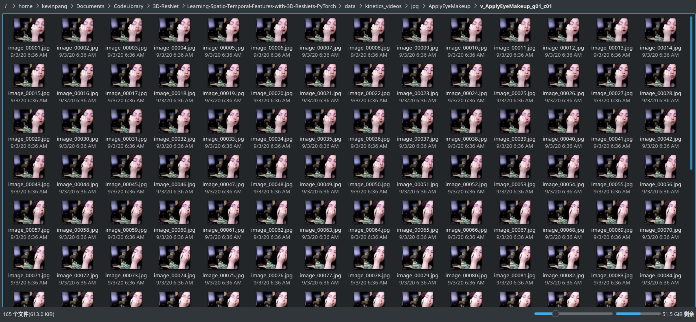

# 3D-ResNets-PaddlePaddle
通过使用PaddlePaddle复现3D ResNets论文

# 1 前期准备工作
在使用PaddlePaddle复现论文代码前，我们需要先理解3D_ResNets论文并用Pytorch跑通一遍代码，理解其传入参数、网络结构、传出参数等。这些我就统一归为前期准备工作。


以下是本人先前阅读论文《Learning Spatio-Temporal Features with 3D Residual Networks
for Action Recognition》时做的一些笔记：

https://blog.csdn.net/qq_41138197/article/details/107832207

以下是论文《Would Mega-scale Datasets Further Enhance Spatiotemporal 3D CNNs》的下载地址：

https://arxiv.org/abs/2004.04968

## 1.1 本地环境配置
- 首先，需要一台N卡的笔记本，然后配置好CUDA和cudnn。Linux环境下Arch系配置方式可参考https://www.bilibili.com/read/cv6438916?spm_id_from=333.788.b_636f6d6d656e74.7
- 然后，安装paddlepaddle-gpu和pytorch。（PaddlePaddle安装可参考https://www.paddlepaddle.org.cn/install/quick；Pytorch建议直接用pip安装pip install torch torchvision）
- 运行过程中如出现"No moudle..."，一般情况下表明你需要使用pip安装对应的包，或者需要调整文件目录结构以保证能够正确调用本地的py文件。

### 本地CUDA安装截图
配置方式可参考：https://www.bilibili.com/read/cv6438916?spm_id_from=333.788.b_636f6d6d656e74.7


## 1.2 目录结构设置

**目录结构**：可理解为文件层级目录，无论是本地还是远程服务器都需要按论文中的要求配置。
```
~/
  data/
    kinetics_videos/
      jpg/
        .../ (directories of class names)
          .../ (directories of video names)
            ... (jpg files)
    results/
      save_100.pth
    kinetics.json
```

## 1.3 理解main.py参数
在执行python main.py时，后可跟一系列的参数，它们是什么意思？有什么作用？这些我们需要在训练前就先尽可能有一个相对清晰的概念。

进入GitHub源码解压后的文件目录，输入 `python main.py -h` 即可查看，若前面配置有小伙伴无法满足（比如N卡），可参考我在本地查到的help：


```bash
[kevinpang@MateBookProX ~]$ cd /home/kevinpang/Documents/CodeLibrary/3D-ResNet/Learning-Spatio-Temporal-Features-with-3D-ResNets-PyTorch
[kevinpang@MateBookProX Learning-Spatio-Temporal-Features-with-3D-ResNets-PyTorch]$ python main.py -h
usage: main.py [-h] [--root_path ROOT_PATH] [--video_path VIDEO_PATH]
               [--annotation_path ANNOTATION_PATH] [--result_path RESULT_PATH]
               [--dataset DATASET] [--n_classes N_CLASSES]
               [--n_pretrain_classes N_PRETRAIN_CLASSES]
               [--pretrain_path PRETRAIN_PATH]
               [--ft_begin_module FT_BEGIN_MODULE] [--sample_size SAMPLE_SIZE]
               [--sample_duration SAMPLE_DURATION]
               [--sample_t_stride SAMPLE_T_STRIDE] [--train_crop TRAIN_CROP]
               [--train_crop_min_scale TRAIN_CROP_MIN_SCALE]
               [--train_crop_min_ratio TRAIN_CROP_MIN_RATIO] [--no_hflip]
               [--colorjitter] [--train_t_crop TRAIN_T_CROP]
               [--learning_rate LEARNING_RATE] [--momentum MOMENTUM]
               [--dampening DAMPENING] [--weight_decay WEIGHT_DECAY]
               [--mean_dataset MEAN_DATASET] [--no_mean_norm] [--no_std_norm]
               [--value_scale VALUE_SCALE] [--nesterov]
               [--optimizer OPTIMIZER] [--lr_scheduler LR_SCHEDULER]
               [--multistep_milestones MULTISTEP_MILESTONES [MULTISTEP_MILESTONES ...]]
               [--overwrite_milestones] [--plateau_patience PLATEAU_PATIENCE]
               [--batch_size BATCH_SIZE]
               [--inference_batch_size INFERENCE_BATCH_SIZE]
               [--batchnorm_sync] [--n_epochs N_EPOCHS]
               [--n_val_samples N_VAL_SAMPLES] [--resume_path RESUME_PATH]
               [--no_train] [--no_val] [--inference]
               [--inference_subset INFERENCE_SUBSET]
               [--inference_stride INFERENCE_STRIDE]
               [--inference_crop INFERENCE_CROP] [--inference_no_average]
               [--no_cuda] [--n_threads N_THREADS] [--checkpoint CHECKPOINT]
               [--model MODEL] [--model_depth MODEL_DEPTH]
               [--conv1_t_size CONV1_T_SIZE] [--conv1_t_stride CONV1_T_STRIDE]
               [--no_max_pool] [--resnet_shortcut RESNET_SHORTCUT]
               [--resnet_widen_factor RESNET_WIDEN_FACTOR]
               [--wide_resnet_k WIDE_RESNET_K]
               [--resnext_cardinality RESNEXT_CARDINALITY]
               [--input_type INPUT_TYPE] [--manual_seed MANUAL_SEED]
               [--accimage] [--output_topk OUTPUT_TOPK]
               [--file_type FILE_TYPE] [--tensorboard] [--distributed]
               [--dist_url DIST_URL] [--world_size WORLD_SIZE]

optional arguments:
  -h, --help            show this help message and exit
  --root_path ROOT_PATH
                        Root directory path
  --video_path VIDEO_PATH
                        Directory path of videos
  --annotation_path ANNOTATION_PATH
                        Annotation file path
  --result_path RESULT_PATH
                        Result directory path
  --dataset DATASET     Used dataset (activitynet | kinetics | ucf101 |
                        hmdb51)
  --n_classes N_CLASSES
                        Number of classes (activitynet: 200, kinetics: 400 or
                        600, ucf101: 101, hmdb51: 51)
  --n_pretrain_classes N_PRETRAIN_CLASSES
                        Number of classes of pretraining task.When using
                        --pretrain_path, this must be set.
  --pretrain_path PRETRAIN_PATH
                        Pretrained model path (.pth).
  --ft_begin_module FT_BEGIN_MODULE
                        Module name of beginning of fine-tuning(conv1, layer1,
                        fc, denseblock1, classifier, ...).The default means
                        all layers are fine-tuned.
  --sample_size SAMPLE_SIZE
                        Height and width of inputs
  --sample_duration SAMPLE_DURATION
                        Temporal duration of inputs
  --sample_t_stride SAMPLE_T_STRIDE
                        If larger than 1, input frames are subsampled with the
                        stride.
  --train_crop TRAIN_CROP
                        Spatial cropping method in training. random is
                        uniform. corner is selection from 4 corners and 1
                        center. (random | corner | center)
  --train_crop_min_scale TRAIN_CROP_MIN_SCALE
                        Min scale for random cropping in training
  --train_crop_min_ratio TRAIN_CROP_MIN_RATIO
                        Min aspect ratio for random cropping in training
  --no_hflip            If true holizontal flipping is not performed.
  --colorjitter         If true colorjitter is performed.
  --train_t_crop TRAIN_T_CROP
                        Temporal cropping method in training. random is
                        uniform. (random | center)
  --learning_rate LEARNING_RATE
                        Initial learning rate(divided by 10 while training by
                        lr scheduler)
  --momentum MOMENTUM   Momentum
  --dampening DAMPENING
                        dampening of SGD
  --weight_decay WEIGHT_DECAY
                        Weight Decay
  --mean_dataset MEAN_DATASET
                        dataset for mean values of mean
                        subtraction(activitynet | kinetics | 0.5)
  --no_mean_norm        If true, inputs are not normalized by mean.
  --no_std_norm         If true, inputs are not normalized by standard
                        deviation.
  --value_scale VALUE_SCALE
                        If 1, range of inputs is [0-1]. If 255, range of
                        inputs is [0-255].
  --nesterov            Nesterov momentum
  --optimizer OPTIMIZER
                        Currently only support SGD
  --lr_scheduler LR_SCHEDULER
                        Type of LR scheduler (multistep | plateau)
  --multistep_milestones MULTISTEP_MILESTONES [MULTISTEP_MILESTONES ...]
                        Milestones of LR scheduler. See documentation of
                        MultistepLR.
  --overwrite_milestones
                        If true, overwriting multistep_milestones when
                        resuming training.
  --plateau_patience PLATEAU_PATIENCE
                        Patience of LR scheduler. See documentation of
                        ReduceLROnPlateau.
  --batch_size BATCH_SIZE
                        Batch Size
  --inference_batch_size INFERENCE_BATCH_SIZE
                        Batch Size for inference. 0 means this is the same as
                        batch_size.
  --batchnorm_sync      If true, SyncBatchNorm is used instead of BatchNorm.
  --n_epochs N_EPOCHS   Number of total epochs to run
  --n_val_samples N_VAL_SAMPLES
                        Number of validation samples for each activity
  --resume_path RESUME_PATH
                        Save data (.pth) of previous training
  --no_train            If true, training is not performed.
  --no_val              If true, validation is not performed.
  --inference           If true, inference is performed.
  --inference_subset INFERENCE_SUBSET
                        Used subset in inference (train | val | test)
  --inference_stride INFERENCE_STRIDE
                        Stride of sliding window in inference.
  --inference_crop INFERENCE_CROP
                        Cropping method in inference. (center | nocrop)When
                        nocrop, fully convolutional inference is performed,and
                        mini-batch consists of clips of one video.
  --inference_no_average
                        If true, outputs for segments in a video are not
                        averaged.
  --no_cuda             If true, cuda is not used.
  --n_threads N_THREADS
                        Number of threads for multi-thread loading
  --checkpoint CHECKPOINT
                        Trained model is saved at every this epochs.
  --model MODEL         (resnet | resnet2p1d | preresnet | wideresnet |
                        resnext | densenet |
  --model_depth MODEL_DEPTH
                        Depth of resnet (10 | 18 | 34 | 50 | 101)
  --conv1_t_size CONV1_T_SIZE
                        Kernel size in t dim of conv1.
  --conv1_t_stride CONV1_T_STRIDE
                        Stride in t dim of conv1.
  --no_max_pool         If true, the max pooling after conv1 is removed.
  --resnet_shortcut RESNET_SHORTCUT
                        Shortcut type of resnet (A | B)
  --resnet_widen_factor RESNET_WIDEN_FACTOR
                        The number of feature maps of resnet is multiplied by
                        this value
  --wide_resnet_k WIDE_RESNET_K
                        Wide resnet k
  --resnext_cardinality RESNEXT_CARDINALITY
                        ResNeXt cardinality
  --input_type INPUT_TYPE
                        (rgb | flow)
  --manual_seed MANUAL_SEED
                        Manually set random seed
  --accimage            If true, accimage is used to load images.
  --output_topk OUTPUT_TOPK
                        Top-k scores are saved in json file.
  --file_type FILE_TYPE
                        (jpg | hdf5)
  --tensorboard         If true, output tensorboard log file.
  --distributed         Use multi-processing distributed training to launch N
                        processes per node, which has N GPUs.
  --dist_url DIST_URL   url used to set up distributed training
  --world_size WORLD_SIZE
                        number of nodes for distributed training
```

## 1.4 解压下载好的UCF-101视频数据集
命令说明：unzip -q 视频数据集压缩包所在目录 -d 解压的目标文件夹


## 1.5 视频转图片

命令格式：python -m util_scripts.generate_video_jpgs 视频地址 生成图片的保存地址 ucf101

将解压后的UCF-101视频文件转换为图片文件，保存在前面介绍的文件路径里面（~data/ucf_videos/jpg）。因为此处用的是UCF数据集，截图中的kinetics_videos应替换为ucf_videos（更改后会更规范一点，当时实现时没注意到这方面，后面实现的小伙伴可以留意留意）。




## 1.6 生成 json 格式的注释文件

python -m util_scripts.ucf101_json annotation_dir_path jpg_video_dir_path dst_json_path

- annotation_dir_path：txt注释文件地址
- jpg_video_dir_path：avi转jpg后，jpg地址
- dst_json_path：json文件存储路径，默认按要求设置在data目录下

## 1.7 开始本地Pytorch训练

```bash
python main.py --root_path /home/kevinpang/Documents/CodeLibrary/3D-ResNet/Learning-Spatio-Temporal-Features-with-3D-ResNets-PyTorch/data --video_path /home/kevinpang/Documents/CodeLibrary/3D-ResNet/Learning-Spatio-Temporal-Features-with-3D-ResNets-PyTorch/data/kinetics_videos/jpg --annotation_path /home/kevinpang/Documents/CodeLibrary/3D-ResNet/Learning-Spatio-Temporal-Features-with-3D-ResNets-PyTorch/data/ucf101_01.json --result_path /home/kevinpang/Documents/CodeLibrary/3D-ResNet/Learning-Spatio-Temporal-Features-with-3D-ResNets-PyTorch/data/results --dataset ucf101 --model resnet --model_depth 50 --n_classes 101 --batch_size 32 --n_threads 16 --checkpoint 1
```
batch_size此处经测试最终本地选用32这个值，因为原先的128会直接导致显存溢出。checkpoint是设置保存训练模型的epoch间隔，此处是每个1个保存一个，仅作测试，实际训练需根据个人实际需求调节。


Ps:运行上述代码时，Pytorch代码时的显存占用，供参考。


# 2 在AI STudio用paddlpaddle实现

## 2.1 解压UCF-101视频数据集


```python
!unzip -q data/data48916/UCF-101.zip -d work/data/ucf_101/video
```

## 2.2 实现视频转图片


```python
!python -m util_scripts.generate_video_jpgs work/data/ucf_101/video/UCF-101 work/data/ucf_101/jpg ucf101
```

    

## 2.3 根据split01划分数据集


```python
!unzip -q split01_ucf.zip -d work/data/
```

### 使用论文提供的脚本文件实现视频转图片


```python
!python -m util_scripts.ucf101_json work/data/split01_ucf work/data/ucf_101/jpg work/data/
```

    Traceback (most recent call last):
      File "/opt/conda/envs/python35-paddle120-env/lib/python3.7/runpy.py", line 193, in _run_module_as_main
        "__main__", mod_spec)
      File "/opt/conda/envs/python35-paddle120-env/lib/python3.7/runpy.py", line 85, in _run_code
        exec(code, run_globals)
      File "/home/aistudio/util_scripts/ucf101_json.py", line 94, in <module>
        args.video_path, dst_json_path)
      File "/home/aistudio/util_scripts/ucf101_json.py", line 45, in convert_ucf101_csv_to_json
        train_database = convert_csv_to_dict(train_csv_path, 'training')
      File "/home/aistudio/util_scripts/ucf101_json.py", line 11, in convert_csv_to_dict
        data = pd.read_csv(csv_path, delimiter=' ', header=None)
      File "/opt/conda/envs/python35-paddle120-env/lib/python3.7/site-packages/pandas/io/parsers.py", line 678, in parser_f
        return _read(filepath_or_buffer, kwds)
      File "/opt/conda/envs/python35-paddle120-env/lib/python3.7/site-packages/pandas/io/parsers.py", line 440, in _read
        parser = TextFileReader(filepath_or_buffer, **kwds)
      File "/opt/conda/envs/python35-paddle120-env/lib/python3.7/site-packages/pandas/io/parsers.py", line 787, in __init__
        self._make_engine(self.engine)
      File "/opt/conda/envs/python35-paddle120-env/lib/python3.7/site-packages/pandas/io/parsers.py", line 1014, in _make_engine
        self._engine = CParserWrapper(self.f, **self.options)
      File "/opt/conda/envs/python35-paddle120-env/lib/python3.7/site-packages/pandas/io/parsers.py", line 1708, in __init__
        self._reader = parsers.TextReader(src, **kwds)
      File "pandas/_libs/parsers.pyx", line 384, in pandas._libs.parsers.TextReader.__cinit__
      File "pandas/_libs/parsers.pyx", line 695, in pandas._libs.parsers.TextReader._setup_parser_source
    FileNotFoundError: File b'work/data/split01_ucf/trainlist02.txt' does not exist


### 使用视频分类实践里面的方法实现视频转图片(本论文复现最终使用的是此数据)


```python
import os
import numpy as np
import cv2

video_src_src_path = 'work/data/ucf_101/video/UCF-101'
video_src_TAG_path = 'work/data/ucf_101/video/UCF-101_JPG'

label_name = os.listdir(video_src_src_path)
label_dir = {}
index = 0
for i in label_name:
    if i.startswith('.'):
        continue
    label_dir[i] = index
    index += 1
    video_src_path = os.path.join(video_src_src_path, i)
    video_save_path = os.path.join(video_src_TAG_path, i) + '_jpg'
    # video_save_path = os.path.join(video_src_TAG_path, i) 
    if not os.path.exists(video_src_TAG_path):
        os.mkdir(video_src_TAG_path)
    if not os.path.exists(video_save_path):
        os.mkdir(video_save_path)
    

    videos = os.listdir(video_src_path)
    # 过滤出avi文件
    videos = filter(lambda x: x.endswith('avi'), videos)

    for each_video in videos:
        each_video_name, _ = each_video.split('.')
        if not os.path.exists(video_save_path + '/' + each_video_name):
            os.mkdir(video_save_path + '/' + each_video_name)

        each_video_save_full_path = os.path.join(video_save_path, each_video_name) + '/'

        each_video_full_path = os.path.join(video_src_path, each_video)

        cap = cv2.VideoCapture(each_video_full_path)
        frame_count = 1
        success = True
        while success:
            success, frame = cap.read()
            # print('read a new frame:', success)

            params = []
            params.append(1)
            if success:
                # cv2.imwrite(each_video_save_full_path + each_video_name + "_%d.jpg" % frame_count, frame, params)
                cv2.imwrite(each_video_save_full_path + each_video_name + "_%d.jpg" % frame_count, frame, [int(cv2.IMWRITE_JPEG_QUALITY), 75])

            frame_count += 1
        cap.release()
np.save('label_dir.npy', label_dir)
# print(label_dir)
```


```python
import os
import numpy as np
import cv2
import sys
import glob
import pickle
from multiprocessing import Pool

label_dic = np.load('label_dir.npy', allow_pickle=True).item()
# print(label_dic)

source_dir = 'work/data/ucf_101/video/UCF-101_JPG'    # 图片保存路径
target_train_dir = 'work/data/ucf_101/video/UCF-101_JPG/train'    # 训练集保存路径
target_test_dir = 'work/data/ucf_101/video/UCF-101_JPG/test'      # 测试集保存路径
target_val_dir = 'work/data/ucf_101/video/UCF-101_JPG/val'        # 验证集保存路径
if not os.path.exists(target_train_dir):
    os.mkdir(target_train_dir)
if not os.path.exists(target_test_dir):
    os.mkdir(target_test_dir)
if not os.path.exists(target_val_dir):
    os.mkdir(target_val_dir)

for key in label_dic:
    each_mulu = key + '_jpg'
    # each_mulu = key 
    print(each_mulu, key)

    label_dir = os.path.join(source_dir, each_mulu)
    label_mulu = os.listdir(label_dir)
    tag = 1
    # print(label_dir)
    # print(len(label_mulu))
    for each_label_mulu in label_mulu:
        image_file = os.listdir(os.path.join(label_dir, each_label_mulu))
        image_file.sort()
        image_name = image_file[0][:-6]
        image_num = len(image_file)
        frame = []
        vid = image_name
        # print(vid)
        sp = int(vid[-6:-4])   ####根据ucf101的split01，通过文件夹名字划分数据集
        # print(sp)
        for i in range(image_num):
            image_path = os.path.join(os.path.join(label_dir, each_label_mulu), image_name + '_' + str(i+1) + '.jpg')
            frame.append(image_path)

        output_pkl = vid + '.pkl'
        if sp >= 8:
            output_pkl = os.path.join(target_train_dir, output_pkl)
        
        else:
            output_pkl = os.path.join(target_val_dir, output_pkl)
        tag += 1
        f = open(output_pkl, 'wb')
        pickle.dump((vid, label_dic[key], frame), f, -1)
        f.close()

```

    JumpRope_jpg JumpRope
    PoleVault_jpg PoleVault
    HorseRace_jpg HorseRace
    Skijet_jpg Skijet
    Nunchucks_jpg Nunchucks
    BoxingSpeedBag_jpg BoxingSpeedBag
    Knitting_jpg Knitting
    Bowling_jpg Bowling
    BenchPress_jpg BenchPress
    SumoWrestling_jpg SumoWrestling
    SoccerPenalty_jpg SoccerPenalty
    StillRings_jpg StillRings
    PlayingTabla_jpg PlayingTabla
    HulaHoop_jpg HulaHoop
    Punch_jpg Punch
    PullUps_jpg PullUps
    WallPushups_jpg WallPushups
    PlayingSitar_jpg PlayingSitar
    MilitaryParade_jpg MilitaryParade
    SalsaSpin_jpg SalsaSpin
    YoYo_jpg YoYo
    BreastStroke_jpg BreastStroke
    CuttingInKitchen_jpg CuttingInKitchen
    PlayingPiano_jpg PlayingPiano
    Haircut_jpg Haircut
    BlowingCandles_jpg BlowingCandles
    Diving_jpg Diving
    Basketball_jpg Basketball
    FloorGymnastics_jpg FloorGymnastics
    BandMarching_jpg BandMarching
    IceDancing_jpg IceDancing
    RockClimbingIndoor_jpg RockClimbingIndoor
    TaiChi_jpg TaiChi
    ShavingBeard_jpg ShavingBeard
    SkyDiving_jpg SkyDiving
    PlayingGuitar_jpg PlayingGuitar
    WalkingWithDog_jpg WalkingWithDog
    HandstandWalking_jpg HandstandWalking
    ParallelBars_jpg ParallelBars
    HandstandPushups_jpg HandstandPushups
    TableTennisShot_jpg TableTennisShot
    HeadMassage_jpg HeadMassage
    PommelHorse_jpg PommelHorse
    FieldHockeyPenalty_jpg FieldHockeyPenalty
    TrampolineJumping_jpg TrampolineJumping
    JugglingBalls_jpg JugglingBalls
    LongJump_jpg LongJump
    Surfing_jpg Surfing
    Hammering_jpg Hammering
    BoxingPunchingBag_jpg BoxingPunchingBag
    PlayingViolin_jpg PlayingViolin
    BalanceBeam_jpg BalanceBeam
    PlayingFlute_jpg PlayingFlute
    BasketballDunk_jpg BasketballDunk
    JavelinThrow_jpg JavelinThrow
    Rowing_jpg Rowing
    PizzaTossing_jpg PizzaTossing
    CliffDiving_jpg CliffDiving
    HighJump_jpg HighJump
    Mixing_jpg Mixing
    VolleyballSpiking_jpg VolleyballSpiking
    ApplyLipstick_jpg ApplyLipstick
    WritingOnBoard_jpg WritingOnBoard
    HammerThrow_jpg HammerThrow
    Drumming_jpg Drumming
    SkateBoarding_jpg SkateBoarding
    RopeClimbing_jpg RopeClimbing
    JumpingJack_jpg JumpingJack
    BaseballPitch_jpg BaseballPitch
    UnevenBars_jpg UnevenBars
    Rafting_jpg Rafting
    MoppingFloor_jpg MoppingFloor
    BabyCrawling_jpg BabyCrawling
    Biking_jpg Biking
    TennisSwing_jpg TennisSwing
    CleanAndJerk_jpg CleanAndJerk
    FrisbeeCatch_jpg FrisbeeCatch
    BrushingTeeth_jpg BrushingTeeth
    Typing_jpg Typing
    CricketBowling_jpg CricketBowling
    BodyWeightSquats_jpg BodyWeightSquats
    CricketShot_jpg CricketShot
    FrontCrawl_jpg FrontCrawl
    Shotput_jpg Shotput
    PlayingDhol_jpg PlayingDhol
    Billiards_jpg Billiards
    Kayaking_jpg Kayaking
    PlayingCello_jpg PlayingCello
    Archery_jpg Archery
    BlowDryHair_jpg BlowDryHair
    GolfSwing_jpg GolfSwing
    SoccerJuggling_jpg SoccerJuggling
    Swing_jpg Swing
    PushUps_jpg PushUps
    PlayingDaf_jpg PlayingDaf
    ApplyEyeMakeup_jpg ApplyEyeMakeup
    ThrowDiscus_jpg ThrowDiscus
    Skiing_jpg Skiing
    Lunges_jpg Lunges
    Fencing_jpg Fencing
    HorseRiding_jpg HorseRiding


```python
import os


data_dir = 'work/data/ucf_101/video/UCF-101_JPG/'

train_data = os.listdir(data_dir + 'train')
train_data = [x for x in train_data if not x.startswith('.')]
print(len(train_data))

# test_data = os.listdir(data_dir + 'test')
# test_data = [x for x in test_data if not x.startswith('.')]
# print(len(test_data))

val_data = os.listdir(data_dir + 'val')
val_data = [x for x in val_data if not x.startswith('.')]
print(len(val_data))

f = open('work/data/ucf_101/video/UCF-101_JPG/train.list', 'w')
for line in train_data:
    f.write(data_dir + 'train/' + line + '\n')
f.close()
# f = open('work/data/ucf_101/video/UCF-101_JPG/test.list', 'w')
# for line in test_data:
#     f.write(data_dir + 'test/' + line + '\n')
# f.close()
f = open('work/data/ucf_101/video/UCF-101_JPG/val.list', 'w')
for line in val_data:
    f.write(data_dir + 'val/' + line + '\n')
f.close()
```

    9537
    3783


## 2.4 训练


```python
!python train.py --use_gpu True --epoch 50 --batch_size 64 --save_dir 'checkpoints_models'  --config 'configs/res3d_L50.txt' --pretrain True
```

    {'MODEL': {'name': 'Res3D', 'format': 'pkl', 'num_classes': 101, 'seg_num': 1, 'seglen': 8, 'image_mean': [0.485, 0.456, 0.406], 'image_std': [0.229, 0.224, 0.225], 'num_layers': 50}, 'TRAIN': {'epoch': 45, 'short_size': 116, 'target_size': 116, 'num_reader_threads': 1, 'buf_size': 1024, 'batch_size': 36, 'use_gpu': True, 'num_gpus': 1, 'filelist': 'work/data/ucf_101/video/UCF-101_JPG/train.list', 'learning_rate': 0.01, 'learning_rate_decay': 0.1, 'l2_weight_decay': 0.0001, 'momentum': 0.9, 'total_videos': 80}, 'VALID': {'short_size': 116, 'target_size': 116, 'num_reader_threads': 1, 'buf_size': 1024, 'batch_size': 1, 'filelist': 'work/data/ucf_101/video/UCF-101_JPG/val.list'}, 'TEST': {'seg_num': 1, 'short_size': 116, 'target_size': 116, 'num_reader_threads': 1, 'buf_size': 1024, 'batch_size': 1, 'filelist': 'work/data/ucf_101/video/UCF-101_JPG/test.list'}, 'INFER': {'short_size': 116, 'target_size': 116, 'num_reader_threads': 1, 'buf_size': 1024, 'batch_size': 1, 'filelist': 'work/data/ucf_101/video/UCF-101_JPG/test.list'}}
    W0905 22:04:32.097486 29064 device_context.cc:252] Please NOTE: device: 0, CUDA Capability: 70, Driver API Version: 10.1, Runtime API Version: 9.0
    W0905 22:04:32.101613 29064 device_context.cc:260] device: 0, cuDNN Version: 7.3.
    Loss at epoch 0 step 0: [14.85315], acc: [0.]
    Loss at epoch 0 step 12: [6.6796126], acc: [0.0625]
    Loss at epoch 0 step 24: [5.414842], acc: [0.078125]
    Loss at epoch 0 step 36: [4.329979], acc: [0.109375]
    Loss at epoch 0 step 48: [4.1428776], acc: [0.15625]
    Loss at epoch 0 step 60: [3.3291516], acc: [0.296875]
    Loss at epoch 0 step 72: [3.5765717], acc: [0.1875]
    Loss at epoch 0 step 84: [3.2602062], acc: [0.28125]
    Loss at epoch 0 step 96: [2.7732463], acc: [0.375]
    Loss at epoch 0 step 108: [2.5205185], acc: [0.390625]
    Loss at epoch 0 step 120: [2.3515425], acc: [0.375]
    Loss at epoch 0 step 132: [2.3940594], acc: [0.390625]
    Loss at epoch 0 step 144: [2.6096253], acc: [0.328125]
    Loss at epoch 1 step 0: [2.2513657], acc: [0.484375]
    Loss at epoch 1 step 12: [1.9614946], acc: [0.515625]
    Loss at epoch 1 step 24: [1.814927], acc: [0.609375]
    Loss at epoch 1 step 36: [1.6050638], acc: [0.59375]
    Loss at epoch 1 step 48: [1.8906935], acc: [0.546875]
    Loss at epoch 1 step 60: [1.5568355], acc: [0.609375]
    Loss at epoch 1 step 72: [1.654619], acc: [0.578125]
    Loss at epoch 1 step 84: [2.1530056], acc: [0.5]
    Loss at epoch 1 step 96: [1.3266186], acc: [0.640625]
    Loss at epoch 1 step 108: [1.5023375], acc: [0.59375]
    Loss at epoch 1 step 120: [1.3825148], acc: [0.65625]
    Loss at epoch 1 step 132: [0.9803108], acc: [0.734375]
    Loss at epoch 1 step 144: [1.4183452], acc: [0.609375]
    Loss at epoch 2 step 0: [1.363558], acc: [0.609375]
    Loss at epoch 2 step 12: [1.3321362], acc: [0.65625]
    Loss at epoch 2 step 24: [1.1997626], acc: [0.640625]
    Loss at epoch 2 step 36: [1.3337362], acc: [0.5625]
    Loss at epoch 2 step 48: [1.2206215], acc: [0.703125]
    Loss at epoch 2 step 60: [1.0951669], acc: [0.75]
    Loss at epoch 2 step 72: [1.0150272], acc: [0.75]
    Loss at epoch 2 step 84: [0.59039515], acc: [0.875]
    Loss at epoch 2 step 96: [0.98881704], acc: [0.765625]
    Loss at epoch 2 step 108: [0.8799726], acc: [0.8125]
    Loss at epoch 2 step 120: [1.0080926], acc: [0.765625]
    Loss at epoch 2 step 132: [0.80505145], acc: [0.875]
    Loss at epoch 2 step 144: [0.69941515], acc: [0.796875]
    Loss at epoch 3 step 0: [0.8660723], acc: [0.828125]
    Loss at epoch 3 step 12: [0.52552694], acc: [0.875]
    Loss at epoch 3 step 24: [0.7111227], acc: [0.765625]
    Loss at epoch 3 step 36: [0.76069826], acc: [0.796875]
    Loss at epoch 3 step 48: [0.64326614], acc: [0.828125]
    Loss at epoch 3 step 60: [0.69727623], acc: [0.84375]
    Loss at epoch 3 step 72: [0.9416874], acc: [0.75]
    Loss at epoch 3 step 84: [0.80490947], acc: [0.84375]
    Loss at epoch 3 step 96: [0.79475594], acc: [0.8125]
    Loss at epoch 3 step 108: [0.6326566], acc: [0.8125]
    Loss at epoch 3 step 120: [0.6236204], acc: [0.796875]
    Loss at epoch 3 step 132: [0.68786544], acc: [0.796875]
    Loss at epoch 3 step 144: [0.6987828], acc: [0.84375]
    Loss at epoch 4 step 0: [0.6295227], acc: [0.8125]
    Loss at epoch 4 step 12: [0.6604608], acc: [0.765625]
    Loss at epoch 4 step 24: [0.43752924], acc: [0.90625]
    Loss at epoch 4 step 36: [0.29913998], acc: [0.921875]
    Loss at epoch 4 step 48: [0.39409184], acc: [0.90625]
    Loss at epoch 4 step 60: [0.67640555], acc: [0.875]
    Loss at epoch 4 step 72: [0.4235146], acc: [0.875]
    Loss at epoch 4 step 84: [0.5107883], acc: [0.875]
    Loss at epoch 4 step 96: [0.5095406], acc: [0.8125]
    Loss at epoch 4 step 108: [0.5783402], acc: [0.8125]
    Loss at epoch 4 step 120: [0.4810606], acc: [0.90625]
    Loss at epoch 4 step 132: [0.70278645], acc: [0.84375]
    Loss at epoch 4 step 144: [0.5491826], acc: [0.84375]
    Loss at epoch 5 step 0: [0.44033235], acc: [0.90625]
    Loss at epoch 5 step 12: [0.37375376], acc: [0.90625]
    Loss at epoch 5 step 24: [0.402488], acc: [0.921875]
    Loss at epoch 5 step 36: [0.41290492], acc: [0.921875]
    Loss at epoch 5 step 48: [0.33651885], acc: [0.9375]
    Loss at epoch 5 step 60: [0.40448695], acc: [0.921875]
    Loss at epoch 5 step 72: [0.3146685], acc: [0.90625]
    Loss at epoch 5 step 84: [0.48406652], acc: [0.859375]
    Loss at epoch 5 step 96: [0.36037546], acc: [0.921875]
    Loss at epoch 5 step 108: [0.4160246], acc: [0.890625]
    Loss at epoch 5 step 120: [0.29046], acc: [0.9375]
    Loss at epoch 5 step 132: [0.3818245], acc: [0.890625]
    Loss at epoch 5 step 144: [0.41643608], acc: [0.90625]
    Loss at epoch 6 step 0: [0.47544712], acc: [0.875]
    Loss at epoch 6 step 12: [0.4636262], acc: [0.84375]
    Loss at epoch 6 step 24: [0.3017388], acc: [0.921875]
    Loss at epoch 6 step 36: [0.27119005], acc: [0.921875]
    Loss at epoch 6 step 48: [0.38429826], acc: [0.890625]
    Loss at epoch 6 step 60: [0.39860123], acc: [0.890625]
    Loss at epoch 6 step 72: [0.26195326], acc: [0.890625]
    Loss at epoch 6 step 84: [0.24620596], acc: [0.9375]
    Loss at epoch 6 step 96: [0.367297], acc: [0.890625]
    Loss at epoch 6 step 108: [0.28543663], acc: [0.9375]
    Loss at epoch 6 step 120: [0.37498397], acc: [0.90625]
    Loss at epoch 6 step 132: [0.24652094], acc: [0.921875]
    Loss at epoch 6 step 144: [0.31677723], acc: [0.9375]
    Loss at epoch 7 step 0: [0.1496607], acc: [0.984375]
    Loss at epoch 7 step 12: [0.30106866], acc: [0.9375]
    Loss at epoch 7 step 24: [0.2952159], acc: [0.921875]
    Loss at epoch 7 step 36: [0.16807702], acc: [0.984375]
    Loss at epoch 7 step 48: [0.27179495], acc: [0.921875]
    Loss at epoch 7 step 60: [0.11121802], acc: [1.]
    Loss at epoch 7 step 72: [0.1859386], acc: [0.96875]
    Loss at epoch 7 step 84: [0.16966134], acc: [0.96875]
    Loss at epoch 7 step 96: [0.15023518], acc: [0.96875]
    Loss at epoch 7 step 108: [0.22545943], acc: [0.953125]
    Loss at epoch 7 step 120: [0.21359515], acc: [0.953125]
    Loss at epoch 7 step 132: [0.22624011], acc: [0.9375]
    Loss at epoch 7 step 144: [0.28296125], acc: [0.9375]
    Loss at epoch 8 step 0: [0.2438523], acc: [0.953125]
    Loss at epoch 8 step 12: [0.20319524], acc: [0.96875]
    Loss at epoch 8 step 24: [0.08904399], acc: [1.]
    Loss at epoch 8 step 36: [0.24717543], acc: [0.9375]
    Loss at epoch 8 step 48: [0.1869955], acc: [0.9375]
    Loss at epoch 8 step 60: [0.27859107], acc: [0.921875]
    Loss at epoch 8 step 72: [0.15005513], acc: [0.984375]
    Loss at epoch 8 step 84: [0.3568893], acc: [0.90625]
    Loss at epoch 8 step 96: [0.24407665], acc: [0.9375]
    Loss at epoch 8 step 108: [0.1589992], acc: [0.96875]
    Loss at epoch 8 step 120: [0.3000587], acc: [0.921875]
    Loss at epoch 8 step 132: [0.15202102], acc: [0.984375]
    Loss at epoch 8 step 144: [0.17012021], acc: [0.96875]


```python
# 备份模型
cp checkpoints_models/res3d_model.pdparams checkpoints_models/res3d_model.pdparams.bak
```

## 2.5 评估


```python
!python eval.py --use_gpu True --weights 'checkpoints_models/res3d_model'  --config "configs/res3d_L50.txt"
```

请点击[此处](https://ai.baidu.com/docs#/AIStudio_Project_Notebook/a38e5576)查看本环境基本用法.  <br>
Please click [here ](https://ai.baidu.com/docs#/AIStudio_Project_Notebook/a38e5576) for more detailed instructions. 
